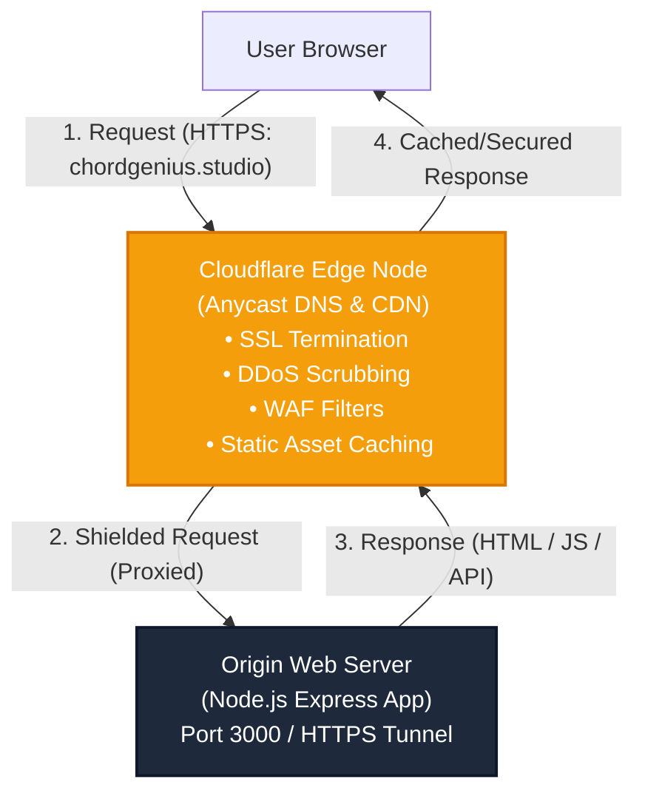
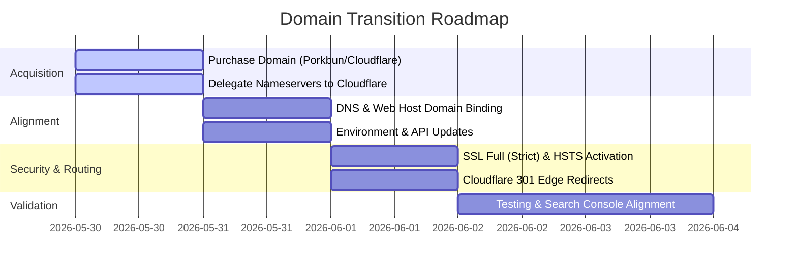

# 🌐 Chord Genius Studio - Custom Domain Acquisition & Migration Strategy Report

This report provides a high-fidelity architectural blueprint and financial comparison for acquiring a dedicated custom domain for **Chord Genius Studio** to replace the temporary subdomain `chordgenius.dewittcyber.com`. It covers domain registrar analysis, multi-year Total Cost of Ownership (TCO) matrices, a deep-dive into Cloudflare's security/performance DNS fabric, and a comprehensive, production-grade migration checklist.

---

## 📊 1. Domain Registrar & TLD Pricing Analysis

Selecting a domain involves balancing upfront costs with long-term renewal fees, support availability, and ecosystem integrations. Below is a detailed evaluation of three top-tier registrars: **Cloudflare Registrar** (known for zero-markup wholesale rates), **Porkbun** (celebrated for its transparent pricing and outstanding human support), and **Namecheap** (known for aggressive introductory promotions).

### 🏷️ Top-Level Domain (TLD) Pricing Matrix
*All prices are in USD and include mandatory ICANN transaction fees ($0.20/yr).*

| TLD Extension | Registrar | 1st Year Promo | Annual Renewal | 3-Year TCO | 5-Year TCO | Features & Caveats |
| :--- | :--- | :--- | :--- | :--- | :--- | :--- |
| **`chordgenius.com`** | **Cloudflare** | **$10.46** | **$10.46** | **$31.38** | **$52.30** | 🥇 **Best TCO.** Flat-rate wholesale. No DNS lock. *Note: Verisign wholesale price will rise to $10.97 (+$0.20 ICANN) on Nov 1, 2026.* |
| | Porkbun | $11.08 | $11.08 | $33.24 | $55.40 | Free WHOIS privacy, 20 free email aliases. |
| | Namecheap | $8.98 | $18.48 | $45.94 | $82.90 | Promos require coupon codes. Free basic DNS. |
| **`chordgenius.net`** | **Cloudflare** | **$12.13** | **$12.13** | **$36.39** | **$60.65** | At-cost pricing. Flat renewal. |
| | Porkbun | $12.52 | $12.52 | $37.56 | $62.60 | Highly competitive. |
| | Namecheap | $11.98 | $18.58 | $49.14 | $86.30 | Higher renewals erode intro savings. |
| **`chordgenius.app`** | **Porkbun** | **$10.81** | $14.93 | **$40.67** | **$70.53** | 🥈 **Best Overall App TCO.** Includes 1st-year promo. |
| | Cloudflare | $14.20 | **$14.20** | $42.60 | $71.00 | Pure wholesale. Neck-and-neck with Porkbun. |
| | Namecheap | $12.98 | $22.98 | $58.94 | $104.90 | Steep renewal markup (~54% over wholesale). |
| **`chordgenius.studio`**| **Porkbun** | **$11.84** | $25.23 | **$62.30** | **$112.76** | 🥇 **Best Studio TCO.** Porkbun's first-year discount makes it slightly cheaper than Cloudflare over 5 years. |
| | Cloudflare | **$23.18** | **$23.18** | **$69.54** | **$115.90** | 💎 **Now Supported.** Pure wholesale cost. Requires Cloudflare Nameservers. |
| | Namecheap | $12.98 | $52.98 | $118.94 | $224.90 | ⚠️ **Avoid.** Massive 110% markup on renewals. |

---

### 🔍 Key Registrar Profiles

#### 1. Cloudflare Registrar
* **Pricing Philosophy:** Strictly **at-cost**. Cloudflare charges exactly what the registry (e.g., Verisign for `.com`) sets, passing along zero retail markup.
* **Pros:** Unbeatable multi-year TCO; unified dashboard if you already use Cloudflare for DNS/CDN; enterprise-grade two-factor authentication (2FA); now supports specialized TLDs like `.studio`.
* **Cons:** No live human support for free plans; **requires using Cloudflare Nameservers** (cannot point domain to non-Cloudflare nameservers directly while registered there); does not support registering domains identified as premium by the registry.

#### 2. Porkbun
* **Pricing Philosophy:** Honest, transparent, low-margin retail. Small markup added to fund operations.
* **Pros:** Best-in-class, friendly human support (phone/email); absolute freedom to point nameservers anywhere; full `.studio` support; includes free WHOIS privacy, SSL, and up to 20 free email aliases (forwarders) out of the box.
* **Cons:** Marginally more expensive than Cloudflare for `.com`/`.net` (by ~$1–$2/year).

#### 3. Namecheap
* **Pricing Philosophy:** Loss-leader marketing. Deep first-year registration discounts compensated by high renewal rates.
* **Pros:** Broad support for almost all TLDs; extensive introductory promo codes; decent 24/7 chat support.
* **Cons:** Over 5 years, the cost of specialized domains like `.studio` skyrockets to **double** what Porkbun charges. Interface is cluttered with cross-sells (hosting, SSL, email).

---

### 💡 Recommendation on Domain Branding & Selection

1. **Brand Identity:** 
   * **`chordgenius.com`** is the gold standard for global credibility, user trust, and search engine optimization (SEO) memory.
   * **`chordgenius.studio`** aligns beautifully with the upgraded premium feel of "Chord Genius Studio" and represents a dedicated, expert workbench for musicians.
   * **`chordgenius.app`** emphasizes the interactive, software-centric capabilities (autoscroll, metronome, capo optimizer) but carries strict browser requirements.
2. **Strategy:** 
    * **If choosing `.com` or `.app`:** Register with **Porkbun** or **Cloudflare**. Porkbun offers a great balance of intro pricing and ease of use, while Cloudflare offers flat wholesale rates.
    * **If choosing `.studio`:** Register with **Porkbun** or **Cloudflare**. Porkbun's first-year discount ($11.84) makes it slightly cheaper than Cloudflare over 5 years ($112.76 vs $115.90) and allows custom nameservers. Cloudflare offers flat, zero-markup wholesale rates ($23.18/yr) and unified dashboard management. Namecheap's $52.98/year renewal is economically inefficient.
   * **HSTS Caution for `.app`:** `.app` is on Google's **HSTS Preload List**. Browsers will *strictly refuse* to load the domain over HTTP. Complete SSL provisioning is mandatory *before* any traffic goes live.

---

## ⚡ 2. DNS Hosting & Edge Security Architecture (Cloudflare)

Regardless of which registrar is selected to purchase the domain, the nameservers should be delegated to **Cloudflare DNS**. Operating as a reverse-proxy CDN at the edge, Cloudflare provides invaluable speed, security, and uptime advantages for a web application.



### 🏎️ Anycast DNS Routing
* **Global Speed:** Cloudflare operates one of the fastest Anycast DNS networks in the world, resolving queries in **<15ms** globally.
* **Resilience:** Queries are routed to the nearest physical data center out of 300+ edge nodes. If one node goes offline, traffic is dynamically rerouted with zero downtime.

### 🛡️ The "Orange Cloud" Proxying Mechanism
* **Origin Shielding:** Hides the public IP address of your origin server (e.g., your VPS or hosting provider). Attackers only see Cloudflare IP addresses, preventing direct-to-IP port scans, SSH brute-forcing, and targeted network exploits.
* **DDoS Protection:** Seamlessly absorbs Layer 3, 4, and 7 DDoS attacks. Cloudflare's massive global network capacity (over 209 Tbps) scrubs malicious traffic at the edge, far away from your origin server.
* **Web Application Firewall (WAF):** Evaluates incoming requests in real-time, blocking malicious crawlers, SQL injections, and cross-site scripting (XSS) attempts before they reach the Express backend (`server.js`).
* **Caching & Performance:** Caches static client-side resources (images, compiled JS, CSS, Google Fonts, and the static shell `public/index.html`). This decreases server response times (TTFB) and reduces the CPU load on your Node.js backend.

### 🔒 Universal SSL/TLS & Edge Security
* **Automated Certificates:** Cloudflare automatically issues and manages free, renewed SSL/TLS certificates (ECDSA) at the edge, eliminating the chore of manually setting up Let's Encrypt cron jobs.
* **Strict Encryption Fabric:** Supports **Full (Strict)** SSL/TLS mode. This guarantees end-to-end encryption:
  1. Browser connects securely to Cloudflare Edge using modern **TLS 1.3**.
  2. Cloudflare Edge connects securely to the origin server using a verified certificate.
* **HSTS & Redirects:** Allows one-click enforcement of **HTTP Strict Transport Security (HSTS)** and **Always Use HTTPS** redirects directly at the edge, saving origin CPU cycles.

### 📈 Uptime and Site Resilience
* **Always Online™:** If the origin web server experiences temporary downtime, Cloudflare can serve a static cached copy of the platform to users instead of a blank "502 Bad Gateway" error page.
* **DDoS Scrubbing:** Automatically detects and mitigates massive botnet scrapers. This keeps your regular user traffic flowing smoothly even when scrapers try to flood the server.

---

## 🗺️ 3. Step-by-Step Routing & Transition Plan

Transitioning the production application from the temporary subdomain `chordgenius.dewittcyber.com` to the new custom domain (e.g., `chordgenius.studio`) requires a systematic, zero-downtime deployment plan.

### 📅 Phase 1: Pre-Acquisition & DNS Delegation
1. **Acquire the Domain:** Purchase your chosen domain (e.g., `chordgenius.studio`) via **Porkbun** (cheaper 5-year TCO and custom nameservers) or **Cloudflare** (flat at-cost wholesale pricing).
2. **Add Domain to Cloudflare:**
   * Log into the Cloudflare Dashboard and select **Add a Site**.
   * Enter the new domain (e.g., `chordgenius.studio`) and choose the **Free Plan**.
3. **Delegate Nameservers:**
   * Copy the two Cloudflare nameservers provided (e.g., `ashley.ns.cloudflare.com` and `oliver.ns.cloudflare.com`).
   * Go to your registrar (e.g., Porkbun) and update your domain’s nameservers to point *exclusively* to Cloudflare.
   * Wait 5–15 minutes for DNS propagation and validation.

### ⚙️ Phase 2: DNS & Origin Hosting Alignment
1. **Configure DNS Records on Cloudflare:**
   * Navigate to **DNS -> Records** in your new domain’s Cloudflare dashboard.
   * Add a **CNAME** record for `@` (root):
     * *Name:* `@`
     * *Target:* Point to your hosting platform's origin target (e.g., your Railway, Render, Fly.io host, or VPS IP).
     * *Proxy Status:* **Proxied (Orange Cloud - Enabled)**.
   * Add a **CNAME** record for `www`:
     * *Name:* `www`
     * *Target:* `@` (reuses root settings).
     * *Proxy Status:* **Proxied (Orange Cloud - Enabled)**.
2. **Bind Domain in Hosting Provider:**
   * Access your hosting provider dashboard (where the Node.js server is deployed).
   * Locate **Custom Domains** or **Network Settings**.
   * Add `chordgenius.studio` and `www.chordgenius.studio` as approved custom domains.
   * *Critical:* **Keep `chordgenius.dewittcyber.com` bound to the same application for now** to ensure the transition is seamless.

### 🔀 Phase 3: Seamless Cloudflare Edge Routing & 301 Redirects
To ensure that existing users, bookmarks, and search results accessing `chordgenius.dewittcyber.com` are seamlessly routed to `https://chordgenius.studio` without losing paths or queries, configure a 301 Permanent Redirect.

#### Option A: Cloudflare Single Redirect Rule (Recommended - Best Performance)
Setting this up on Cloudflare's edge prevents redirect requests from ever hitting your server, saving bandwidth and processing power.

1. In the Cloudflare dashboard for the **old domain** (`dewittcyber.com`), navigate to **Rules -> Redirect Rules**.
2. Click **Create Rule** and name it `Redirect ChordGenius Subdomain`.
3. Under **When incoming requests match...**, configure:
   * *Field:* `Hostname`
   * *Operator:* `equals`
   * *Value:* `chordgenius.dewittcyber.com`
4. Under **Then...**, configure:
   * *Type:* `Dynamic`
   * *Target URL (Expression):* `concat("https://chordgenius.studio", http.request.uri.path)`
   * *Status Code:* `301` (Moved Permanently)
   * *Preserve Query String:* **Checked** (ensures URLs like `chordgenius.dewittcyber.com/?song=123` redirect correctly to `chordgenius.studio/?song=123`).

#### Option B: Express Backend Middleware (Fallback / VPS Deployment)
If you manage the server hosting environment directly, you can enforce the redirect inside your Node.js application (`server.js`) as a fail-safe:

```javascript
// Add early in your server.js middleware stack
app.use((req, res, next) => {
  const host = req.get('host');
  if (host === 'chordgenius.dewittcyber.com') {
    return res.redirect(301, `https://chordgenius.studio${req.originalUrl}`);
  }
  next();
});
```

### 🔒 Phase 4: SSL/TLS Provisioning & HSTS Enforcement
1. In Cloudflare, navigate to **SSL/TLS -> Overview**.
2. Change the SSL/TLS encryption mode to **Full (Strict)**.
3. Navigate to **SSL/TLS -> Edge Certificates**:
   * Turn **ON** "Always Use HTTPS".
   * Turn **ON** "Opportunistic Encryption".
   * Turn **ON** "Automatic HTTPS Rewrites" (automatically patches any mixed-content HTTP links in your markup to HTTPS).
   * Click **HSTS (HTTP Strict Transport Security)** -> Click **Enable**:
     * *Max Age:* 12 months (31,536,000 seconds).
     * *Include Subdomains:* Enabled.
     * *Preload:* Enabled (highly recommended; mandatory if using a `.app` domain).

### 🔑 Phase 5: OAuth, API & Environment Variable Alignment
1. **Update Server Environment Variables:**
   * In your hosting provider's variables pane (or your `.env` file), update your primary domain configurations:
     ```env
     NODE_ENV=production
     PORT=3000
     APP_URL=https://chordgenius.studio
     ```
   * Restart the application server to apply the updated environment.
2. **Update External Integrations:**
   * **Google Developer Console:** If using Google OAuth, add `https://chordgenius.studio/oauth2/callback` to your authorized redirect URIs.
   * **GitHub Developer Settings:** If using GitHub Auth, update the homepage and callback URLs.
   * **Webmaster Tools:** Add `https://chordgenius.studio` as a new property in **Google Search Console** and submit a **Change of Address** tool request to transfer SEO authority from the old subdomain.
   * **Web Scraper Headers:** Ensure that internal API scrapers use the new origin host headers to avoid confusing target servers.

### 🧪 Phase 6: Post-Migration Validation & Clean-Up
1. **Perform Verification Checks:**
   * Open a private browser window and load `http://chordgenius.dewittcyber.com`. Confirm that it redirects instantly and smoothly to `https://chordgenius.studio`.
   * Open the developer console and verify that all static assets, API calls (e.g., `/api/convert`), and transposition calls load over HTTPS with **zero mixed-content warnings**.
   * Run a SSL diagnostic test via SSL Labs (`ssllabs.com`) to confirm a secure **A+** rating.
   * Test interactive components (metronome, autoscroll, capo calculator) to ensure no socket or relative-path errors occur.
2. **Decommission Old Subdomain:**
   * Maintain the Cloudflare Redirect Rule for `chordgenius.dewittcyber.com` indefinitely (or for at least 90 days) to catch legacy bookmarks and organic search engine links.
   * Once search engines have fully re-indexed the new domain and no traffic appears on the old hostname logs, you can safely remove the host binding from your web server, leaving only the Cloudflare edge redirect active.

---

## 🚀 Strategic Roadmap Summary



### 🏆 Executive Action Plan
To unlock premium branding and robust performance immediately, we recommend:
1. **Purchase `chordgenius.studio`** via **Porkbun** or **Cloudflare** (Porkbun offers an intro discount of **$11.84** and a standard renewal of **$25.23/yr**, making its 5-year TCO slightly cheaper than Cloudflare's flat **$23.18/yr** wholesale rate, while Cloudflare provides a single unified interface if already using their DNS/CDN proxy).
2. **Optionally purchase `chordgenius.com`** via **Cloudflare Registrar** for **$10.46/yr** as a defensive brand acquisition, setting up an edge redirect to point `chordgenius.com` to `chordgenius.studio`.
3. **Configure the Cloudflare Free Tier** as the Anycast DNS manager for both domains, enabling the Edge proxy, DDoS protection, and end-to-end **Full (Strict) SSL** to establish a secure, fast, and highly resilient architecture for **Chord Genius Studio**.
