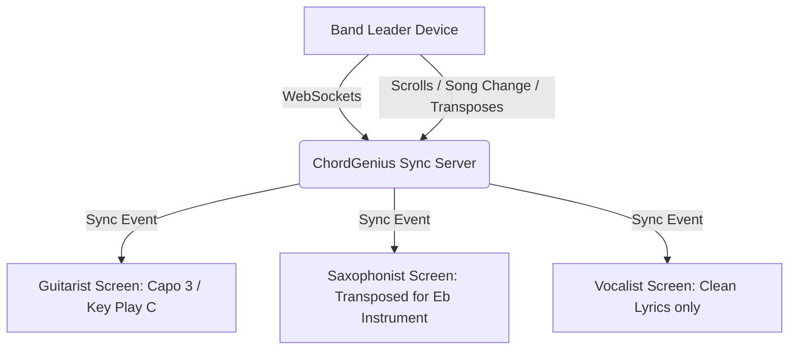

# 🎸 ChordGenius Studio: Future Vision & Adventurous Feature Ideation

This document outlines a high-fidelity competitive research analysis, transparent monetization frameworks, and a highly creative, adventurous expansion plan to elevate **ChordGenius Studio** into the ultimate digital companion for live gigging and practicing musicians.

---

## 🔍 Part 1: Competitor Landscape & Market Gaps

To build the ultimate platform, we analyzed the dominant digital sheet music, chord repository, and rehearsal utilities. Below is a map of the market, identifying what they do well and—more importantly—where they fail.

### 📊 Competitive Comparison Matrix

| Platform | Best For | Pricing Model | Core Strengths | Critical Gaps & Weaknesses |
| :--- | :--- | :--- | :--- | :--- |
| **Ultimate Guitar Pro** | Amateur practice & massive song catalog | ~$25/mo or $99/yr (Frequent confusing sales) | Gigantic library; interactive multi-instrument playback; official tabs; built-in metronome. | **Predatory subscription traps** (notorious cancellation loops); extremely cluttered, ad-heavy, resource-intensive UI; no professional binder compilation exports; lacks ChordPro export. |
| **OnSong (iOS)** | Professional gigging & stage performance | ~$30-50/yr (Subscription) | Industry-standard chord rendering (ChordPro); foot pedal integration; MIDI automation; backing track triggers. | **Apple ecosystem lock-in** (iOS only); steep learning curve; no built-in web scraping engine to pull and clean tabs on the fly; outdated UI aesthetics. |
| **SongbookPro** | Cross-platform gig viewing | ~$6.99 (One-time purchase) | Clean cross-platform sync (iOS, Android, Windows); lightweight; offline support. | Lacks advanced automated intelligence (e.g., Chord Simplify, Smart Capo Optimization); no automated web search scraping; no multi-column binder assembly with automatic indices. |
| **BandHelper / Set List Maker** | Complex band management | $15 - $100/yr (Tiered by member count) | Exceptional MIDI automation, stage cues, band synchronization, gig finance tracking. | **Extremely dated, clunky UX** (looks like 2012 Android app); overwhelming setup friction; high learning curve; poor design aesthetics. |
| **Planning Center Services** | Church worship teams | $12 - $199+/mo (Based on team size) | Powerful service planning, team scheduling, chord chart management, rehearsal audio attachment. | Heavily gated, highly expensive, and hyper-niched for churches; not useful for solo musicians, touring acts, or local garage bands. No on-the-fly search and scrape. |

---

## 💡 Part 2: The ChordGenius Unique Value Proposition (UVP)

ChordGenius is uniquely positioned to exploit these market gaps. By combining a **bot-resilient web scraper**, a **smart key transposition engine**, and **premium PDF/Word document compilers**, ChordGenius provides:

1. **Zero Catalog Limits:** Instantly fetch and clean any song on the internet, skipping Ultimate Guitar's ad-walled and locked printing features.
2. **Beautiful Monospaced Sheet Output:** High-fidelity multi-column and single-sheet layouts with customizable, clean metadata headers.
3. **Advanced Musician Automations:** Capo and voicing optimizer, web-audio metronome, interactive editors, and seamless ChordPro formats.
4. **Modern, Gorgeous Aesthetics:** A premium, warm-cream, glassmorphic UI that feels state-of-the-art and respects user attention (no ads, no popups).

---

## 💸 Part 3: Transparent, Honest Monetization Framework

Unlike competitors (like Ultimate Guitar) who rely on aggressive, hidden auto-renewals and complex billing funnels, ChordGenius will pioneer a **Musician-First Transparent Pricing Strategy**.

### 🌟 Active Tiers (Post-Beta)

> [!NOTE]
> During the current **Beta Phase**, all users are automatically upgraded to the **Pro Tier** for free, branded as **"Beta Explorer"** to incentivize feedback and community-driven testing.

```
+---------------------------------------------------------------------------------+
|                                 PRICING TIERS                                   |
+--------------------------+---------------------------+--------------------------+
|      BETA EXPLORER       |        PRO ARTIST         |      BAND SYNDICATE      |
|          $0/mo           |       $4.99/mo or $45/yr  |         $12.99/mo        |
|  * Universal Pro Access  |  * Unlimited Scrapes      |  * Everything in Pro     |
|  * Help Shape the App    |  * ChordPro Import/Export |  * Shared Setlist Sync   |
|  * Early Adopter Badge   |  * Multi-Format Binders   |  * Up to 5 synced screens|
|                          |  * Pro Glossary & Tooltips|  * Shared Band Library   |
+--------------------------+---------------------------+--------------------------+
```

### 🤝 The Anti-Predatory billing Charter:
* **No Cancellation Loops:** A prominent, single-click "Cancel Subscription" button directly in the user profile dashboard.
* **Pre-Renewal Reminders:** An automated email sent **7 days before** an annual subscription renews, giving the user ample time to cancel if they no longer need it.
* **Pro-Rata Refunds:** If a user forgets to cancel and is charged, they can request a 100% refund within 3 days of renewal with zero questions asked.

---

## 🚀 Part 4: Adventurous & Creative Feature Proposals

Here are six highly creative, game-changing features and dedicated pages to make ChordGenius the most powerful tool in a musician's arsenal.

### 1. 🎤 "Vocal Range Matcher" & Capo Optimizer
* **Concept:** Every singer has a unique vocal range, and transposing songs to fit their voice is usually a painstaking trial-and-error process. 
* **How It Works:** We introduce a **Vocal Calibration Page**. The user clicks "Calibrate" and sings their lowest comfortable note and highest comfortable note into their device microphone (analyzed via a lightweight in-browser Autocorrelation Pitch Detector).
* **The Magic:** Once calibrated (e.g., range established as $A2$ to $E4$), ChordGenius scans the vocal melody of any song searched (utilizing key/scale ranges or crowd-sourced vocal limits) and automatically transposes the song to the user's **Golden Key**—recommending the exact capo placement to minimize difficult barre chords while fitting their vocal sweet spot.
* **Musician Value:** Eliminates voice cracking, saves transposition time, and ensures every song in their setlist is comfortable to sing.

### 2. 🎛️ "Stage Mode" with Foot Pedal & Gestures
* **Concept:** When performing live on stage, a musician cannot touch their screen with their hands. They need a highly legible, distraction-free, and hands-free interface.
* **How It Works:** A dedicated **"Stage View" Page** featuring:
  * **Ultra-High Contrast UI:** Pure dark/light background modes with oversized chords and massive, responsive lyric fonts.
  * **Foot Pedal Integration:** Listening to standard keyboard page-down/up triggers (sent by Bluetooth foot pedals like AirTurn or PageFlip) to scroll or switch songs.
  * **Smart Autoscroll & Beat Flash:** Seamlessly scroll through the sheet music matched to the song's BPM. The screen borders can flash with a subtle, transparent warm glow on every downbeat (silent metronome).
  * **Visual Stage Cues:** Add colored section markers (e.g., red border for **[Chorus]**, green for **[Solo]**) for split-second navigation in dim stage lighting.

### 3. 👥 "Band Sync" (Low-Latency Collaborative Stage)
* **Concept:** Bands struggle to stay on the same page. If the lead singer decides to change the key of a song on the fly, or scroll down, the keyboardist and guitarist are left scrambling.
* **How It Works:** A multi-device session creator.
  * The Band Leader clicks **"Create Sync Session"** and gets a 4-digit code (e.g., `CG-8931`).
  * Band members enter the code on their devices (tablets, phones, laptops).
  * **Synchronized States:** When the leader changes songs in the setlist, transposes the key, or scrolls, the active sheet updates on *all* connected devices in near real-time (<50ms delay) using a lightweight WebSocket server connection.
  * **Role-Based Transposition:** If the session key is transposed to Eb, the saxophone player's screen automatically transposes to C (for Eb instruments), the guitarist's screen transposes to C with Capo 3, and the singer sees the vocal chart—all synced to the same spot!



### 📈 4. "Setlist Flow & Time Estimator"
* **Concept:** Rehearsing and planning a setlist requires precision. Performing for too long results in venue fines; performing too short disappoints fans.
* **How It Works:** Inside the Setlist Builder panel:
  * **Duration Calculation:** ChordGenius pulls song duration data via the Spotify API, or estimates it using BPM, measure counts, and typical lyric densities.
  * **Interactive Setlist Timeline:** A beautiful visual drag-and-drop timeline showing:
    * Active music playtime.
    * Customizable transition blocks (e.g., "+3 mins: Band Introductions", "+2 mins: Acoustic instrument swap").
    * **Key Transition Analysis:** A color-coded warning system that alerts the user of harsh key changes (e.g., moving from a song in B Major directly into C# minor, or suggesting a transition key/capo to smooth the acoustic flow).
  * **Total Estimate:** Dynamically calculates total gig time (e.g., *"Setlist Duration: 43 mins of 45 mins allocated. Perfect!"*).

### 🧠 5. "Dynamic Ear Trainer" & Roman Numeral Analyzer
* **Concept:** Great musicians don't just read charts—they understand the underlying harmonic relationships to play by ear or improvise.
* **How It Works:** An interactive togglable **"Analysis Mode"** in the chord sheet viewer.
  * **Nashville Numbers & Roman Numerals:** Instantly convert standard chords into Roman numerals (e.g., in Key of G, converting `G -> Em -> C -> D` into `I -> vi -> IV -> V`).
  * **Progression Visualization:** Displays a circular "Chord Map" showing how the chords move within the Circle of Fifths.
  * **Fretboard / Keyboard Heatmap:** A virtual instrument fretboard that updates in real-time, showing the optimal voicing shapes and the scale degrees (e.g., root, 3rd, 5th) of the active chord, helping players visualize *why* the progression sounds good and how to solo over it.

### 📊 6. "The Gig Tracker & Business Hub"
* **Concept:** Professional musicians are small business owners, but they lack clean digital tools to catalog their performances and manage setlist histories.
* **How It Works:** A new dedicated **"Gigs" page**:
  * **Gig Registry:** Save setlists linked to specific venues, dates, pay, and crowd sizes.
  * **Song Popularity Analytics:** Visual charts showing which songs are played the most, average key selection, and BPM distribution.
  * **Setlist Archiver:** Re-open past gigs with a single click to instantly practice or export the exact binder used on a specific night in the past.

---

## 🛠️ Part 5: Technical Feasibility & System Integration

These advanced features seamlessly plug into the existing ChordGenius ecosystem, leveraging your powerful Node.js engine and responsive UI structure:

```
                  +-------------------------------------------------+
                  |          Existing Core Express Server           |
                  |                   (server.js)                   |
                  +------------------------+------------------------+
                                           |
                    +----------------------+----------------------+
                    |                                             |
+-------------------v------------------+  +-----------------------v------------------+
|      New WebSocket Sync Handler      |  |         Audio Pitch Analysis Engine      |
|   (Manages low-latency Band Sync     |  |     (Autocorrelation pitch detection     |
|      session broadcasting)           |  |        for Vocal Range Matcher)          |
+--------------------------------------+  +------------------------------------------+
                    |                                             |
                    +----------------------+----------------------+
                                           |
                  +------------------------v------------------------+
                  |         Premium Sheet Compilation Renderer      |
                  |                   (engine.js)                   |
                  +-------------------------------------------------+
```

1. **Vocal Matcher Pitch Engine:** Can be built as a pure client-side javascript module in the browser using the Web Audio API `AudioContext` and `AnalyserNode`. It requires **zero** additional backend overhead and runs instantly on standard phone/laptop microphones.
2. **Band Sync:** Can be built using standard `socket.io` or vanilla `ws` (WebSockets) on top of the existing Express [server.js](file:///c:/Users/Dwitt/Projects/ChordGeniusWebpage/server.js) file. Session creation requires minimal memory, simply storing active socket connections in an array.
3. **Stage Mode:** Utilizes standard browser APIs like keyboard listener triggers for foot pedal integration and lightweight canvas drawing or CSS animations for the visual metronome pulsing.

---

## 🗳️ Part 6: Feedback & Voting Loop

*Which of these ideas should we prototype first? Let me know your thoughts or assign priorities (High / Med / Low) for each:*

- [ ] **1. Vocal Range Matcher & Capo Optimizer** — Priority: \_\_\_\_\_\_
- [ ] **2. Stage Mode with Foot Pedal & Silent Metronome** — Priority: \_\_\_\_\_\_
- [ ] **3. Band Sync (Multi-Device Collaborative Stage)** — Priority: \_\_\_\_\_\_
- [ ] **4. Setlist Flow & Time Estimator** — Priority: \_\_\_\_\_\_
- [ ] **5. Dynamic Ear Trainer & Roman Numeral Analyzer** — Priority: \_\_\_\_\_\_
- [ ] **6. Gig Tracker & Business Hub** — Priority: \_\_\_\_\_\_

---
*Created by Antigravity for ChordGenius Studio. Pair-programming towards professional musicianship.*
