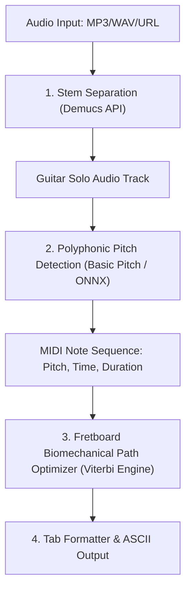

# 🛠️ ChordGenius Studio: Pivoted Creative Ideas Implementation Plans

This document provides technical blueprints and implementation plans for the high-impact creative features of **ChordGenius Studio**, focusing on architectural design, algorithmic challenges, and the **AI Audio-to-Guitar-Tab Creator**.

---

## 🗺️ Tech Stack Overview
To support these advanced client-side and server-side utilities, the existing Node.js/HTML/Vanilla CSS stack will be augmented with specific libraries:
*   **Audio Transcription/Processing:** TensorFlow.js / ONNX Runtime (Client) or PyTorch server-side API.
*   **OCR Parsing:** `Tesseract.js` (Web Workers to prevent UI thread blocking).
*   **Real-time Communications:** `Socket.io` (WebSockets for collaborative stage sync).
*   **Audio Analysis:** Web Audio API (analyser node for client-side pitch calibration).

---

## 🎸 Plan 1: AI Audio-to-Guitar-Tab Creator (TSK-501)

Creating guitar tablature from audio is a two-step machine learning and algorithmic problem: **Polyphonic Pitch Transcription** (identifying notes played) and **Biomechanical Fretboard Mapping** (assigning notes to strings and frets).



### 1. Audio Processing & Stem Separation
*   **Method:** Mixed tracks make guitar isolation difficult. We send the uploaded audio to a lightweight backend worker running **Meta's Demucs** or **Spleeter** to separate the audio into four stems (vocals, drums, bass, other/guitar).
*   **Output:** The isolated guitar audio track is returned to the transcription engine.

### 2. Polyphonic Pitch Transcription
*   **Method:** The guitar stem is processed by an ONNX runtime port of Spotify's **Basic Pitch** model (or run on the backend if GPU acceleration is needed).
*   **Output:** A list of note events containing:
    $$\text{Note} = \{\text{Frequency (Hz)}, \text{Onset Time (s)}, \text{Offset Time (s)}\}$$

### 3. Biomechanical Fretboard Mapping (The Optimization Engine)
Unlike piano (where one key maps to one note), guitar notes are redundant. The note $E_4$ (329.63 Hz) can be played in 5 different positions on a standard guitar neck:
1.  Open 1st string (E)
2.  5th fret, 2nd string (B)
3.  9th fret, 3rd string (G)
4.  14th fret, 4th string (D)
5.  19th fret, 5th string (A)

To find the most playable fret path, we use **Dynamic Programming (Viterbi Algorithm)** to minimize a **Biomechanical Hand Movement Cost Function** ($C_{\text{total}}$):

$$C_{\text{total}} = \sum_{i=1}^{n-1} \left( w_1 \cdot D_{\text{fret}}(i, i+1) + w_2 \cdot D_{\text{string}}(i, i+1) + w_3 \cdot C_{\text{span}}(i+1) \right)$$

Where:
*   $D_{\text{fret}}(i, i+1) = |F_{i+1} - F_i|$: Minimizes jumping up and down the neck (horizontal fret distance).
*   $D_{\text{string}}(i, i+1) = |S_{i+1} - S_i|$: Minimizes jumping across strings (vertical string distance).
*   $C_{\text{span}}(i+1)$: If multiple notes sound simultaneously (a chord), we penalize finger spans exceeding 4 frets:
    $$C_{\text{span}} = \begin{cases} 0 & \text{if } \max(F) - \min(F) \le 4 \\ \infty & \text{if } \max(F) - \min(F) > 5 \end{cases}$$
*   $w_1, w_2, w_3$: Weights calibrated via test datasets of professional guitar transcriptions.

### 4. ASCII Formatter & Export
The computed string/fret coordinates are aligned rhythmically based on the onset/offset timings and printed to standard 6-line ASCII tablature (which can be edited by the user).

---

## 🛰️ Plan 2: WebSocket-Driven "Stage Sync" (TSK-502)

To keep multi-device band members synchronized on stage with less than 50ms latency.

```
       [Band Leader's Device]
                 |
        (Socket.io Event) -> "sync-scroll" / "change-song"
                 |
                 v
        [Node.js WebSocket Server]
                 |
      (Broadcast to Room Code)
                 |
    +------------+------------+
    |                         |
    v                         v
[Bassist Device]       [Singer Device]
 (Auto-Scrolls)        (Giant Lyrics View)
```

### 1. Network & Room Management
*   **Room Codes:** Generate temporary 4-letter alphanumeric session codes (e.g., `KJZW`) stored in the Node.js backend memory.
*   **Socket.io Event Payloads:**
    *   `join-room`: `{ roomCode: string, role: 'leader'|'follower', instrument: string }`
    *   `sync-scroll`: `{ scrollPercentage: float }` (using percentage avoids pixel-height mismatches on different screen resolutions).
    *   `load-song`: `{ songId: string, baseKey: string }`
    *   `metronome-tap`: `{ bpm: int, state: 'play'|'stop', startTime: EpochMS }`

### 2. Client Rendering Optimization
*   Followers' devices listen for `sync-scroll` events. To prevent jarring visual stuttering, we apply a CSS transition timing function (`scroll-behavior: smooth`) coupled with a throttle on scroll events (maximum of 10 events per second).

---

## 📷 Plan 3: "Binder Digitizer" OCR Scanner (TSK-503)

Digitizes analog paper chord sheets using client-side Optical Character Recognition.

### 1. Document Preprocessing
*   The uploaded image is preprocessed in canvas: turned grayscale, and contrast-boosted to make text crisp.
*   `Tesseract.js` is loaded inside a browser **Web Worker** to perform text extraction without freezing the active UI thread.

### 2. Chord-Lyric Extraction Parser
The raw text returned contains lines of chords and lyrics. The system uses a parser to classify each line:
```javascript
function classifyLine(line) {
    const trimmed = line.trim();
    if (trimmed === "") return "empty";
    
    // Check if line consists almost entirely of chord characters, spaces, and brackets
    const chordTokenRegex = /^([A-G][#b]?(m|min|maj|dim|aug|sus|add|\d)*(\/[A-G][#b]?)?|NC|\s)+$/i;
    if (chordTokenRegex.test(trimmed)) {
        return "chords";
    }
    
    // Check for song section headers (e.g., [Verse 1], Chorus:)
    if (/^\[?(Intro|Verse|Chorus|Bridge|Outro|Pre-Chorus|Solo)\]?:?$/i.test(trimmed)) {
        return "header";
    }
    
    return "lyrics";
}
```
### 3. Conversion to ChordPro
The parser pairs adjacent `chords` and `lyrics` lines. It computes the index spacing of chords in the chord line and injects them in brackets directly into the lyric line (e.g., `[G]Hello [C]World`), formatting it into standard, portable ChordPro markup.

---

## 🗣️ Plan 4: Vocal Range Matcher & "Golden Key" Finder (TSK-504)

Detects the performer’s physical vocal range to automatically suggest ideal key transpositions.

### 1. Audio Spectrum Capture
*   Uses `navigator.mediaDevices.getUserMedia` to request microphone access.
*   Initializes the browser's Web Audio API `AudioContext` and connects an `AnalyserNode` to capture frequency data.

### 2. Pitch Detection Algorithm (Autocorrelation)
To find the fundamental frequency ($F_0$) of the singer's voice in real time, we use a time-domain autocorrelation algorithm, which is highly resilient to harmonic noise:

$$R(k) = \sum_{t=0}^{N-1} x(t) \cdot x(t+k)$$

The lag $k$ corresponding to the highest peak in $R(k)$ indicates the vocal pitch.

### 3. Range Mapping
1.  **Calibration phase:** User sings their lowest comfortable note for 3 seconds, then their highest note.
2.  **MIDI Mapping:** Frequencies are converted to MIDI note numbers:
    $$n = 12 \cdot \log_2\left(\frac{F_0}{440}\right) + 69$$
3.  **Tessitura Calculation:** The app calculates their vocal range boundaries. When a song is loaded, the key's melody range (read from metadata or inferred from chord roots) is shifted so that the highest/lowest notes of the song sit comfortably within the center of the user's vocal boundary, outputting the suggested transposed key.
