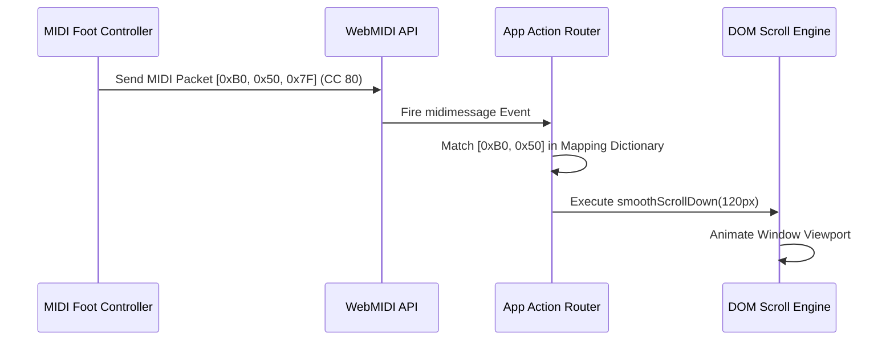
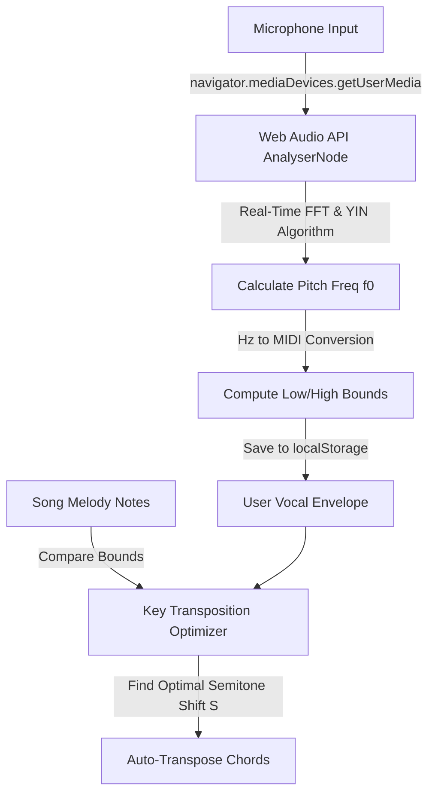
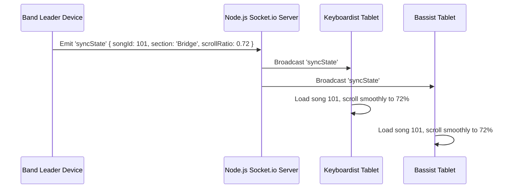
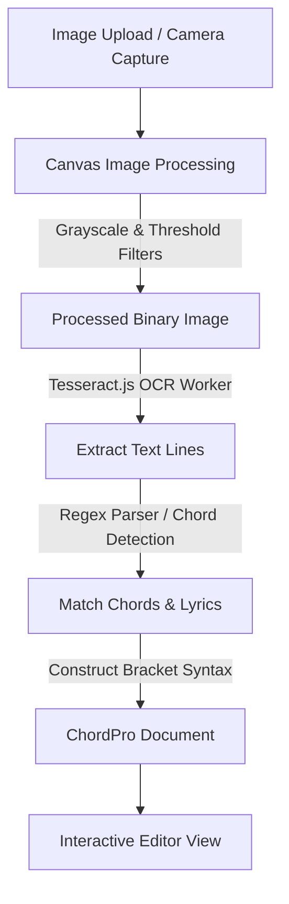

# 🎸 ChordGenius Studio: Pivoted Creative Ideas Implementation Plans

This document provides a highly detailed technical research, architectural breakdown, and step-by-step implementation roadmap for the **20 pivoted creative ideas** identified for ChordGenius Studio. 

These ideas represent the strategic evolution of ChordGenius from a web-scraping utility into a **premium music rehearsal workstation, live stage companion, and collaborative band tool**.

---

## 🗺️ Architectural Roadmap Overview

To ensure performance, responsiveness, and premium aesthetics, the implementation of these 20 features will rely on a standardized frontend/backend web technology stack:
*   **Web Audio API & DSP:** Used for metronomes, pitch-shifting players, and real-time chord detection.
*   **WebMIDI API:** Used for gear integration, controllers, and preset launchers.
*   **Presentation API & BroadcastChannel:** Used for multi-window cast displays.
*   **WebSockets (Socket.io):** Used for real-time collaboration and stage syncing.
*   **TensorFlow.js / MediaPipe:** Used for machine learning webcam tracking.
*   **Tesseract.js & Canvas API:** Used for client-side document digitization.

---

## 🎛️ Section 1: Live Stage Performance (Stage Mode)

### 1. 🟢 Interactive "Bouncing Ball" Visual Metronome

*   **Overview & Target Audience:** Performing musicians who need a silent, non-distracting timing guide on stage without in-ear click leaks.
*   **Technical Architecture & Web APIs:**
    *   **Beat Scheduling:** Built on the Web Audio API's precise clock (`audioContext.currentTime`) to avoid JS main-thread lag.
    *   **Visual Rendering:** Powered by HTML5 Canvas or an absolute SVG overlay rendered via a high-performance `requestAnimationFrame` loop.
    *   **Position Interpolation:** 
        *   The system parses the ChordPro text and maps each chord element to its relative absolute X/Y screen coordinates in the browser DOM.
        *   For each beat, the ball's Y-coordinate follows a sine wave bounce:
            $$y(t) = y_0 - |H \cdot \sin(\pi \cdot \text{beat\_progress})|$$
        *   The X-coordinate is linearly interpolated from the current chord position to the next:
            $$x(t) = x_{\text{prev}} + (x_{\text{next}} - x_{\text{prev}}) \cdot \text{beat\_progress}$$
*   **Step-by-Step Implementation:**
    1.  **Parser Update:** Modify the ChordPro parser to wrap chords in a custom span `<span class="beat-node" data-beat="N">`.
    2.  **Scheduler:** Implement a high-precision lookahead scheduler in JS that queues beat events every 25ms.
    3.  **Coordinate Mapping:** On resize or song load, query the bounding box (`getBoundingClientRect()`) of all `.beat-node` spans to build a position lookup table.
    4.  **Canvas Animation Loop:** Create a transparent overlay canvas over the chord sheet. Render a glowing neon green circle bouncing along the coordinate path.
*   **UI/UX Mockup Specs:**
    *   **Ball Style:** A `#00FF88` (Neon Green) circle with a 15px radius and a `filter: drop-shadow(0 0 8px var(--primary))` glow effect.
    *   **Path Indicator:** A thin, semi-transparent dashed line tracking the upcoming bounce.
    *   **BPM Controls:** A sleek glassmorphic HUD overlay at the top of the Stage View.
*   **The Dream Product Experience:** The singer loads "Yellow". A neon orb starts hopping gracefully from chord word to chord word. As the verse progresses, the ball glides smoothly in perfect sync with the tempo, completely eliminating the need for distracting flashing screen edges or clicking sounds.

---

### 2. 🎚️ MIDI-Mapped Auto-Scroll & Page Turning

*   **Overview & Target Audience:** Gigging instrumentalists (guitarists, keyboardists, drummers) whose hands are occupied and cannot touch the screen to scroll or switch pages.
*   **Technical Architecture & Web APIs:**
    *   **Hardware Interface:** Uses the WebMIDI API (`navigator.requestMIDIAccess()`).
    *   **Event Handling:** Listens to incoming MIDI messages on all connected devices. The message contains 3 bytes: `[Status, Data1, Data2]`.
        *   Note On events: `0x90` to `0x9F`.
        *   Control Change (CC) events: `0xB0` to `0xBF`.
    *   **Storage:** Binds MIDI message identifiers to specific client action functions in a mapping dictionary saved to `localStorage`.
*   **Step-by-Step Implementation:**
    1.  **Permission Request:** Call `requestMIDIAccess({ sysex: false })` on Stage Mode activation.
    2.  **MIDI Learner Interface:** Build a modal that prompts: *"Press any button/pedal on your MIDI controller..."*, captures the first incoming `[Status, Data1]` pair, and prompts the user to select an action.
    3.  **Scroll Engine Integration:** Map the MIDI events to page navigation:
        *   CC #80 -> Smooth Scroll Down (`window.scrollBy({ top: 100, behavior: 'smooth' })`).
        *   CC #81 -> Smooth Scroll Up.
        *   Note On C-1 -> Jump to next song in Setlist.
*   **UI/UX Mockup Specs:**
    *   **Mapping Dashboard:** A dark glassmorphic grid displaying current bindings:
        | Trigger / Input | Action | Status |
        | :--- | :--- | :--- |
        | `FCB1010 Pedal 1` | Scroll Down | Connected |
        | `Synth Key C1` | Next Song | Connected |
    *   **Visual Indicators:** A tiny MIDI icon flashes in the status bar whenever a MIDI packet is received.
*   **The Dream Product Experience:** A guitarist taps their physical foot controller on the floor to trigger a transition. The digital chart on their iPad immediately glides down to the Chorus, ensuring they never miss a chord change or ruin their performance posture.



---

### 3. 🖥️ "Congregation Mode" Lyric Projection Casting

*   **Overview & Target Audience:** Small worship leaders, acoustic duos, and bars where the audience needs to see clean lyrics on a second display while the performer views chords and stage notes.
*   **Technical Architecture & Web APIs:**
    *   **Display Casting:** Uses the Presentation API (`navigator.presentation`) to locate secondary displays, with a fallback to `window.open` for projector screens.
    *   **State Syncing:** Establishes a `BroadcastChannel` named `cg_stage_sync` to transmit active lyrics in real time without lag.
    *   **DOM Injection:** Dynamically compiles a stripped version of the active sheet (filtering out all chords, capos, and internal notes).
*   **Step-by-Step Implementation:**
    1.  **Caster Client:** Add a "Cast to Projector" button that triggers `window.open('/projector.html', 'CG_Cast', 'menubar=no,toolbar=no')`.
    2.  **Sync Handler:** In the main window, whenever a line is focused (either via auto-scroll, bouncing ball, or manual hover), transmit:
        ```javascript
        const syncChannel = new BroadcastChannel('cg_stage_sync');
        syncChannel.postMessage({ type: 'LYRIC_FOCUS', lyricText: 'I will sing forever of your love...' });
        ```
    3.  **Receiver Window:** The projector window listens to the channel and displays the lyric centered, utilizing CSS transitions for fading lines:
        ```css
        .lyric-line { opacity: 0; transition: opacity 0.5s ease-in-out; }
        .lyric-line.active { opacity: 1; font-size: 5rem; }
        ```
*   **UI/UX Mockup Specs:**
    *   **Presenter Control Panel:** A small toggle in Stage Mode: `[ Cast Active: Connected ]` with a preview box showing what the audience sees.
    *   **Projector View:** Ultra-clean, pitch-black background, white typography (`font-family: 'Outfit', sans-serif`), large centered text, and zero borders or buttons.
*   **The Dream Product Experience:** The worship leader taps "Cast". Instantly, the TV screen facing the congregation displays beautiful, large, fading lyrics synced perfectly to their performance. The leader keeps full chord visibility on their tablet, completely eliminating the need for dedicated slide operators.

---

### 4. 📳 "Gig Bag" Gear Preset & MIDI Command Launcher

*   **Overview & Target Audience:** Live performers who use digital modeling processors (Line 6 Helix, Quad Cortex, Kemper) or MIDI-controlled synthesizer patches and want to automate preset switching between songs.
*   **Technical Architecture & Web APIs:**
    *   **Communication:** WebMIDI API (`MIDIPort.send()`).
    *   **MIDI Command Construction:**
        *   **Program Change (PC):** `0xC0 | (channel - 1)` followed by the preset number (0-127).
        *   **Control Change (CC):** `0xB0 | (channel - 1)` followed by controller number and value.
    *   **State Machine:** Listen to setlist song navigation events. When a song loads, extract the MIDI metadata and transmit it.
*   **Step-by-Step Implementation:**
    1.  **Schema Extension:** Update the song metadata template to support a `midiPresets` array:
        ```json
        "midiPresets": [
          { "port": "UM-ONE", "channel": 1, "type": "PC", "val1": 42 }
        ]
        ```
    2.  **Sender Engine:** Build a utility `sendMidiCommand(preset)` that maps the JSON fields into standard MIDI byte arrays:
        ```javascript
        const statusByte = 0xC0 | (preset.channel - 1);
        midiOutput.send([statusByte, preset.val1]);
        ```
    3.  **Hooks:** Wire the sender engine to the song activation hook in Stage Mode.
*   **UI/UX Mockup Specs:**
    *   **Preset Configuration Panel:** A glassmorphic accordion inside the Song Editor titled "MIDI Presets". Includes dropdowns for MIDI Channel, Command Type (PC, CC), and input fields for Values.
    *   **Visual Alert:** A temporary, non-intrusive toast notification: *"Helix configured to Preset 12B"* flashes when a song opens.
*   **The Dream Product Experience:** The singer-guitarist selects "Coldplay - Yellow" on their tablet. Before they can hit the first strum, their delay pedal automatically switches to a warm analog delay, their vocal processor turns on three-part harmony, and their keyboard loads a bright pad patch.

---

## 🏋️ Section 2: Smart Practice & Coaching

### 5. 🔁 "The Shred Coach" Speed Ramping Looper

*   **Overview & Target Audience:** Rehearsing musicians aiming to master complex leads, solos, or fast tempos by practicing in a hands-free, incremental loop.
*   **Technical Architecture & Web APIs:**
    *   **Loop Control:** Bound to the audio engine (using HTML5 `<audio>` playback rates or Web Audio API buffer scheduling).
    *   **Tempo Modulation:**
        *   Calculates tempo speed multipliers:
            $$\text{playbackRate} = \frac{\text{Current BPM}}{\text{Original BPM}}$$
        *   Updates the audio playback speed: `audioElement.playbackRate = playbackRate`.
*   **Step-by-Step Implementation:**
    1.  **Selection Capture:** Enable text highlighting on the chord chart to set the "Loop Start" and "Loop End" bounds.
    2.  **Scheduler Loop:** Monitor playback position. When the playhead crosses the "Loop End" timestamp, reset the playhead to the "Loop Start" timestamp.
    3.  **Speed Incrementer:** Implement a counter that triggers on loop completion. If `currentBPM < targetBPM`, increment the tempo:
        `currentBPM = Math.min(targetBPM, currentBPM + bpmStep)`.
    4.  **Audio Rate Adjustment:** Adjust the audio player playback rate and visually update the metronome speed.
*   **UI/UX Mockup Specs:**
    *   **Control Panel:** A floating widget at the bottom of the practice view. Features input fields for:
        *   Start BPM (e.g., `80`)
        *   Target BPM (e.g., `120`)
        *   Increment (e.g., `+5 BPM` per loop)
    *   **Visualizer:** A circular gauge tracking speed progress from green (slow) to pulsing neon red (target speed).
*   **The Dream Product Experience:** A guitarist selects the solo section of a song. They start playing along at 70% speed. Each time they complete the loop, the backing track and metronome speed up by 5% automatically. Their hands never leave the guitar fretboard until they successfully nail the solo at 100% tempo.

---

### 6. 🗣️ Vocal Range Matcher & "Golden Key" Finder

*   **Overview & Target Audience:** Vocalists and backing singers looking to find the optimal transposition key for any song without straining their vocal range.
*   **Technical Architecture & Web APIs:**
    *   **Signal Processing:** Uses Web Audio API with `AnalyserNode` for real-time FFT processing.
    *   **Pitch Detection Algorithm:** Autocorrelation or YIN pitch detection to identify the fundamental frequency (\(f_0\)) in Hz.
    *   **Key Mapping:**
        *   Convert low/high frequencies to MIDI note numbers:
            $$p = 69 + 12 \cdot \log_2\left(\frac{f_0}{440}\right)$$
        *   Extract the melody note range of the target song (parsed from custom metadata or MIDI database).
        *   Calculate the transposition offset that centers the song's melody range within the singer's vocal envelope.
*   **Step-by-Step Implementation:**
    1.  **Mic Calibration Page:** A step-by-step wizard prompting the user to hum/sing their lowest comfortable note for 3 seconds, followed by their highest note.
    2.  **Frequency Analyzer:** Calculate average frequency and filter out harmonics/screeches. Convert output values to note names (e.g., low: `F2`, high: `G4`).
    3.  **Key Calculator:** Compare the song's original melody range (e.g., `C3` to `D4`) against the user's range. Compute the optimal key transposition factor \(S\) in semitones.
    4.  **Auto-Transpose:** Apply \(S\) to the song's chords on confirmation.
*   **UI/UX Mockup Specs:**
    *   **Interactive Tuner Graphic:** A beautiful semi-circular gauge displaying notes (from C1 to C8) with a glowing wave indicating the singer's real-time pitch.
    *   **Vocal Range Card:** A custom badge on the user's profile: *"Your Range: Tenor (G2 - A4)"*.
    *   **One-Click Optimization Button:** A magic wand icon next to transposition controls labeled "Fit to My Voice".
*   **The Dream Product Experience:** A new singer opens a high-pitched song like "Bohemian Rhapsody". Instead of guessing keys, they click "Fit to My Voice". The app transposes the entire chart down 3 semitones, placing the highest notes comfortably within their range and preventing throat strain.



---

### 7. 🔊 Real-Time Pitch & Formant-Shifting Audio Player

*   **Overview & Target Audience:** Instrumentalists and vocalists practicing along with backing tracks or YouTube audio who want the audio to transpose to match their customized sheet key.
*   **Technical Architecture & Web APIs:**
    *   **Audio DSP:** Powered by Tone.js (`Tone.PitchShift`) or custom AudioWorklet nodes compiled from WebAssembly phase-vocoder implementations.
    *   **Pitch Manipulation:** Shifts audio pitch in semitones (from -12 to +12) while keeping tempo (duration) unaltered.
    *   **Formant Correction:** Maintains natural timber, avoiding the "chipmunk" or "giant" vocal distortions.
*   **Step-by-Step Implementation:**
    1.  **Audio Routing:** Route audio element output through the Web Audio graph:
        `MediaElementAudioSourceNode` -> `Tone.PitchShift` -> `AudioContext.destination`.
    2.  **Transposition Sync:** Listen to chord sheet key change events. Translate the key change semitone difference to the pitch shift node's pitch property:
        `pitchShiftNode.pitch = targetKeySemitone - originalKeySemitone`.
    3.  **Buffer Buffer Management:** Implement local audio caching for uploaded MP3 files to ensure low-latency real-time manipulation.
*   **UI/UX Mockup Specs:**
    *   **Audio Player Bar:** A sleek cassette-tape style overlay containing play, pause, progress bar, key, and tempo controllers.
    *   **Formant Switch:** A small toggle badge: `[ Formant Protection: Active ]`.
    *   **Tone Controls:** Glowing rotary knobs for fine-tuning cents and semitones.
*   **The Dream Product Experience:** A singer changes a backing track's key from E major to C major. The audio player transposes the audio down in real time, keeping the drums and instruments sharp and the vocals natural, allowing them to rehearse with the original track at their own pitch.

---

### 8. 📸 "Voicing Fingerprint" Webcam Tracker

*   **Overview & Target Audience:** Novice players learning guitar or keyboard who want automated, real-time feedback on their finger and hand placement.
*   **Technical Architecture & Web APIs:**
    *   **Machine Learning Engine:** Utilizes MediaPipe Hand Landmarker via client-side WebGL acceleration.
    *   **Coordinate Extraction:** Tracks 21 coordinates per hand in a 3D coordinate space.
    *   **Classification Engine:** Calculates distances and angles between finger joints to detect shapes:
        *   Guitar: Distance between thumb position and finger joint segments.
        *   Piano: Spatial alignment of fingertips relative to a calibrated keyboard plane.
*   **Step-by-Step Implementation:**
    1.  **MediaPipe Initializer:** Load `@mediapipe/tasks-vision` via dynamic CDN import.
    2.  **Video Stream:** Open device front-facing camera using `getUserMedia`. Render the stream to a hidden `<video>` element.
    3.  **Frame Predictor:** Run the hand landmarker at 15 FPS. Extract finger joint arrays:
        `landmarks = result.landmarks[0]`.
    4.  **Fingering Matcher:** Compare the spatial fingerprint against a library of known chord shapes. If a match is found, update the UI state.
*   **UI/UX Mockup Specs:**
    *   **Camera Card Overlay:** A small, rounded overlay box (240x180px) in the bottom right corner with a glowing neon border.
    *   **Skeletal Landmark Overlays:** Draw green/red skeleton lines directly onto the user's hand on the canvas stream.
    *   **HUD Alerts:** Floating green checks next to chord labels on the sheet when played correctly.
*   **The Dream Product Experience:** A beginner struggles to play a B minor chord. They turn on webcam tracking. The app highlights their index finger in red, showing it needs to lay flat across the 2nd fret. When they correct their hand shape, the skeleton turns bright green, verifying the voicing is correct.

---

## 👥 Section 3: Collaborative Band Technology

### 9. 🛰️ WebSocket-Driven "Stage Sync"

*   **Overview & Target Audience:** Professional band members, church worship bands, and ensemble acts who want their sheet music views synced to the band leader's scroll position.
*   **Technical Architecture & Web APIs:**
    *   **Real-time Communication:** Powered by a Node.js Socket.io backend.
    *   **State Distribution:** Synchronization payload contains song identifier, active section, scroll offset ratio, and play state.
    *   **Client Smoothing:** Clients apply interpolation algorithms to prevent scrolling stuttering from network jitter.
*   **Step-by-Step Implementation:**
    1.  **Socket.io Server Setup:** Create a socket gateway with endpoints: `joinRoom(roomCode)`, `leaveRoom()`, and `syncState(payload)`.
    2.  **Leader Transmitter:** In the leader's Stage Mode, throttle scroll event listeners to emit sync messages every 100ms:
        ```javascript
        socket.emit('syncState', { scrollRatio: scrollY / maxScroll, section: currentSection });
        ```
    3.  **Follower Interpolator:** Followers catch the payload. If the offset difference is greater than 30px, scroll smoothly:
        ```javascript
        window.scrollTo({ top: payload.scrollRatio * maxScroll, behavior: 'smooth' });
        ```
*   **UI/UX Mockup Specs:**
    *   **Room Panel:** A top header indicator: `[ Room Code: CG-9081 ]` with icons representing online band members (e.g. Drums, Vocal, Guitar).
    *   **Role Picker:** A simple modal when joining: *"Are you leading or following?"*.
*   **The Dream Product Experience:** During a live worship service, the band leader decides to repeat the bridge. As they scroll back up on their tablet, all the band members' screens scroll to the bridge instantly, keeping the entire band aligned.



---

### 🎭 10. Dynamic Multi-Role Layouts

*   **Overview & Target Audience:** Multi-instrumentalist bands who want customized, role-specific views from a single master chord sheet.
*   **Technical Architecture & Web APIs:**
    *   **State Management:** Reactive rendering based on user role settings (`singer`, `guitarist`, `bassist`, `keyboardist`).
    *   **Parser Filters:**
        *   `singer`: Remove all chords: `line.replace(/\[.*?\]/g, '')`.
        *   `bassist`: Strip chord extensions, keeping only the root notes: `chord.replace(/(maj|m|7|9|sus)/g, '')`.
        *   `keyboardist`: Display piano keyboard voicing layouts.
        *   `guitarist`: Display standard guitar fretboard diagrams.
*   **Step-by-Step Implementation:**
    1.  **Filter Module:** Build a parser filter suite in JS that runs before rendering.
    2.  **Diagram Renderer:** Implement visual diagram renderers for guitar frets and piano keys using dynamic SVG elements.
    3.  **Role Selector:** Add a toggle bar in Stage View to change roles on the fly, storing selection in `localStorage`.
*   **UI/UX Mockup Specs:**
    *   **Role Bar:** A glassmorphic toolbar at the top:
        *   🎙️ Vocal (Lyrics Only, High Contrast text, size: 28px)
        *   🎸 Guitar (Chords + Capo Diagrams)
        *   🎹 Keys (Chords + Piano voicings)
        *   🎻 Bass (Roots Only)
*   **The Dream Product Experience:** The bassist, keyboardist, and singer open the same song. The bassist sees a simple root note progression, the keyboardist sees piano keyboard voicing overlays, and the singer sees large lyrics without chord letters.

---

### 🤝 11. Live Setlist Collaboration & Repertoire Vote

*   **Overview & Target Audience:** Bands coordinating setlists democratically during rehearsals or gig planning.
*   **Technical Architecture & Web APIs:**
    *   **Drag-and-Drop:** Driven by the HTML5 Drag and Drop API or `SortableJS` library.
    *   **Data Sync:** Updates are stored in a database (e.g. PostgreSQL) and synced to connected users via Socket.io.
    *   **Conflict Resolution:** Operations are queued sequentially to avoid collisions when multiple users edit the list simultaneously.
*   **Step-by-Step Implementation:**
    1.  **Database Migration:** Add `setlist_items` tables with sorting orders and voting arrays.
    2.  **Sortable Dashboard:** Implement SortableJS inside a Vue/React or vanilla component to handle list reordering.
    3.  **Reordering Hooks:** On drag end, transmit the updated order array to the backend, which broadscasts the change to all other room members.
*   **UI/UX Mockup Specs:**
    *   **Reorder Interface:** Cards containing drag handles, song titles, key badges, and tempo stats.
    *   **Vote Badges:** Glowing up/down buttons on each song card with a voter count indicator.
*   **The Dream Product Experience:** During rehearsal, band members vote on which songs to include in the setlist. The drummer drags a song up to change the order. The list reorders on everyone's screen in real-time, keeping setlist planning collaborative.

---

### 📣 12. Public "Live Request Portal" & Stripe Tip Jar

*   **Overview & Target Audience:** Performing musicians looking to engage live audiences, accept requests, and capture digital tips directly.
*   **Technical Architecture & Web APIs:**
    *   **Payment Processing:** Integrates Stripe Elements API for secure credit card and Apple/Google Pay transactions.
    *   **Push Notifications:** WebSocket alerts push requests to the artist's dashboard.
*   **Step-by-Step Implementation:**
    1.  **Public Route:** Set up `/artist/:username/requests` presenting the artist's public setlist.
    2.  **Stripe Setup:** Create a backend endpoint `POST /api/tips/create-intent` that generates a Stripe payment intent.
    3.  **Client Checkout:** Integrate Stripe Elements into the request modal. Upon successful payment, emit the request payload:
        ```javascript
        socket.emit('audienceRequest', { song: 'Wonderwall', tip: 10.00, message: 'For John!' });
        ```
    4.  **Artist HUD:** Listen to the event in Stage Mode and display the incoming request.
*   **UI/UX Mockup Specs:**
    *   **Audience View:** A mobile-first, responsive grid with search filters, tipping amounts ($5, $10, $20, Custom), and an input field for messages.
    *   **Artist Toast Alert:** A slide-in card in Stage Mode showing the song title, tip amount, and message:
        > 📥 **Request Received:** **Wonderwall** ($10.00)
        > *"Play this for John's birthday!"*
*   **The Dream Product Experience:** An audience member scans a QR code on the guitarist's mic stand, selects a song, and tips $10 via Apple Pay. The request instantly pops up on the guitarist's tablet, allowing them to play the request and thank the fan.

---

## 🧠 Section 4: AI-Driven & Assistive Formatting

### 13. 📷 "Binder Digitizer" OCR Scanner

*   **Overview & Target Audience:** Musicians transitioning from physical binders to digital formats who want a fast conversion tool.
*   **Technical Architecture & Web APIs:**
    *   **OCR Processing:** Uses `Tesseract.js` for client-side Optical Character Recognition.
    *   **Image Processing:** Canvas API handles image enhancements (contrast adjustments, grayscaling, thresholding).
    *   **Parsing Heuristics:**
        *   Analyze lines of text: lines with high ratios of capital letters, spaces, and sharps/flats (e.g. `C#m`, `G`, `F#`) are identified as chords.
        *   Combine chord lines and lyrics into structured ChordPro format: `[Chord] Lyric text`.
*   **Step-by-Step Implementation:**
    1.  **Image Upload:** Construct a file input element with camera capture parameters: `<input type="file" accept="image/*" capture="camera">`.
    2.  **Grayscale Filter:** Draw the image on a hidden Canvas and apply a grayscale threshold filter:
        ```javascript
        const d = imgData.data;
        for (let i = 0; i < d.length; i += 4) {
          const v = (d[i] + d[i+1] + d[i+2]) / 3 > 128 ? 255 : 0;
          d[i] = d[i+1] = d[i+2] = v;
        }
        ctx.putImageData(imgData, 0, 0);
        ```
    3.  **Tesseract OCR:** Run OCR on the processed canvas.
    4.  **ChordPro Parser:** Process lines to find chords and wrap them in brackets:
        `[C]Line [G]Lyrics`.
*   **UI/UX Mockup Specs:**
    *   **Upload Screen:** A drag-and-drop container with a dashed border.
    *   **Split Screen View:** A side-by-side display showing the uploaded photo on the left and the editable, parsed text on the right.
*   **The Dream Product Experience:** A musician takes a picture of a paper sheet. Tesseract extracts the text, separates chords from lyrics, and displays a clean ChordPro chart on their screen, ready for transposition and setlist integration.



---

### 🔢 14. Circle of Fifths Modulation Assistant

*   **Overview & Target Audience:** Songwriters and arrangers looking for smooth transitions between keys.
*   **Technical Architecture & Web APIs:**
    *   **Theory Engine:** Modulates chords programmatically using musical intervals.
    *   **Modulation Patterns:**
        *   *Secondary Dominant:* V7 of the target key.
        *   *Pivot Chord:* Chords shared by both the starting and target keys.
*   **Step-by-Step Implementation:**
    1.  **Circle Component:** Build an interactive Circle of Fifths dial using SVG.
    2.  **Transition Calculator:** Implement a transition engine:
        ```javascript
        function getPivotChords(keyA, keyB) {
          return keyA.chords.filter(chord => keyB.chords.includes(chord));
        }
        ```
    3.  **UI Injector:** Insert modulation pathways into the song editor at the selected transition point.
*   **UI/UX Mockup Specs:**
    *   **Interactive Circle:** A circular SVG dial representing keys. Shows harmonic links to neighboring keys when hovered.
    *   **Transition Card:** A dropdown menu displaying options like:
        *   *Direct Modulation*
        *   *Pivot Chord: [ Am (ii in G / vi in C) ]*
        *   *Secondary Dominant: [ D7 -> G ]*
*   **The Dream Product Experience:** A songwriter modulates from C major to E major. The app suggests playing a `B7` secondary dominant or an `F#m` pivot chord to ease the key change, inserting the chords directly into their chart.

---

### 🖐️ 15. Smart "Capo vs. Key" Ergonomic Cost Optimizer

*   **Overview & Target Audience:** Guitarists seeking to avoid tiring or complex barre chords while matching a vocalist's key.
*   **Technical Architecture & Web APIs:**
    *   **Ergonomic Algorithm:** Ranks chord shapes based on physical difficulty.
        *   Open chords (C, G, D, A, E) = 1
        *   Simple barre chords (Bm, F) = 4
        *   Complex barres (F#m, C#m) = 6
        *   High-stretch extensions = 8
    *   **Mathematical Model:**
        $$\text{Cost}(c) = \sum_{i} \text{Difficulty}(\text{Transpose}(chord_i, -c))$$
        Where \(c\) is the capo fret (0 to 11). The algorithm finds the capo position that minimizes this cost.
*   **Step-by-Step Implementation:**
    1.  **Difficulty Dictionary:** Define difficulty scores for common chord shapes.
    2.  **Capo Optimizer Function:** Calculate the difficulty score for each capo option from 0 to 11.
    3.  **Result Selector:** Select the capo setting that yields the lowest score and display the corresponding open chord names.
*   **UI/UX Mockup Specs:**
    *   **Optimization Widget:** A card inside the transposition drawer displaying a guitar fretboard.
    *   **Comparison Chart:** A visual list showing capo options, chord shapes, and difficulty scores (from easy green to hard red).
*   **The Dream Product Experience:** A guitarist loads a song in Ab major containing difficult barre chords. The app suggests placing a capo on the 1st fret and playing in G major, shifting the chord shapes to easy open voicings while keeping the song in the same key.

---

### ✍️ 16. ChordPro Interactive SVG Fretboard Editor

*   **Overview & Target Audience:** Musicians using customized chord voicings or alternate guitar tunings.
*   **Technical Architecture & Web APIs:**
    *   **Fretboard Component:** Built as an interactive SVG grid tracking fret/string intersections.
    *   **Metadata Integration:** Custom voicings are serialized into ChordPro `{define}` tags:
        `{define: C/G base-fret 1 frets 3 3 2 0 1 0}`
*   **Step-by-Step Implementation:**
    1.  **Fretboard SVG:** Build a responsive grid representing 6 strings and 5 frets.
    2.  **Click Listener:** Add event listeners to grid points to toggle fingering indicators.
    3.  **Parser Sync:** Generate the ChordPro `{define}` syntax and insert it at the top of the document.
*   **UI/UX Mockup Specs:**
    *   **Visual Grid:** Clean lines for strings and frets, with finger markers showing finger numbers (1-4).
    *   **Fret Markers:** A toggle to set the base fret offset.
    *   **Audio Preview:** Play chord voicings using audio synthesis when hovering over diagrams.
*   **The Dream Product Experience:** A guitarist creates a custom chord voicing. They click on the fretboard grid to place their fingers. The app updates the visual diagram on their chart and saves the custom voicing to their library.

---

## 📅 Section 5: Setlist & Gig Business Management

### 17. ⏱️ Setlist Time Buffer & Flow Analyst

*   **Overview & Target Audience:** Performing musicians planning structured live sets.
*   **Technical Architecture & Web APIs:**
    *   **Timeline Engine:** Tracks song durations, tempos, and keys on a linear timeline.
    *   **Transition Analysis:** Uses key distance calculations (Camelot Wheel / Circle of Fifths steps) to flag jarring changes.
*   **Step-by-Step Implementation:**
    1.  **Schema Extension:** Add duration, tempo, and key parameters to setlists.
    2.  **Analysis Engine:** Compare keys between adjacent songs. If the distance exceeds 2 steps on the Circle of Fifths, flag the transition.
    3.  **Interface Integration:** Allow users to insert speech or tuning buffers into the timeline.
*   **UI/UX Mockup Specs:**
    *   **Timeline Chart:** A linear timeline showing song segments, durations, and keys.
    *   **Warning Badges:** Red warning flags for dissonant key changes:
        > ⚠️ **Key Clash:** E major to F minor (+1 semitone shift).
*   **The Dream Product Experience:** A band builds a setlist. The app alerts them to a sudden key transition between songs, prompting them to insert a transitional modulation or adjust the song order to improve the flow of their set.

---

### 💼 18. Gig Ledger & Payout Tracker

*   **Overview & Target Audience:** Touring gig musicians tracking business finances, travel costs, and merch sales.
*   **Technical Architecture & Web APIs:**
    *   **Database Schema:** CRUD ledger tracking income, expenses, mileage, and tax statistics.
    *   **Data Visualization:** Renders interactive performance graphs using Chart.js or SVG components.
*   **Step-by-Step Implementation:**
    1.  **Ledger Schema:** Build data structures for gigs, mileage, and expense items.
    2.  **Calculation Module:** Compute statistics like net income, mileage deductions, and hourly rates.
    3.  **Dashboard View:** Build the ledger interface showing financial statistics.
*   **UI/UX Mockup Specs:**
    *   **Financial Cards:** Sleek cards displaying metrics like *Net Profit*, *Expense Ratio*, and *Hourly Income*.
    *   **Responsive Charts:** Interactive charts tracking revenue, gig expenses, and merch sales.
*   **The Dream Product Experience:** A musician enters their payout and fuel costs after a show. The app updates their dashboard, tracking profitability across venues and organizing tax-deductible expenses in one place.

---

### 📖 19. "Setlist Booklet" PDF Compiler

*   **Overview & Target Audience:** Band leaders preparing physical booklets for guest players.
*   **Technical Architecture & Web APIs:**
    *   **PDF Generation:** Uses `pdfmake` or `jsPDF` for client-side document generation.
*   **Step-by-Step Implementation:**
    1.  **Booklet Compiler:** Gather charts from the active setlist.
    2.  **PDF Layout Design:** Apply CSS print layouts to structure pages, including titles, lyrics, and chords.
    3.  **Index Generation:** Compile a chord glossary displaying diagrams for all chords used in the setlist.
*   **UI/UX Mockup Specs:**
    *   **Print Preview:** A visual overlay showing page breaks, page numbers, and formatting layouts.
    *   **Download Button:** A clean action button: `[ Download Setlist Booklet PDF ]`.
*   **The Dream Product Experience:** A band leader clicks "Generate Booklet" before a gig. The app compiles all setlist charts, adding a cover page, table of contents, and chord glossary into a single, printable PDF document.

---

### 🎹 20. Audio-to-Chord Ear Trainer (Chordify-Lite)

*   **Overview & Target Audience:** Rehearsing musicians practicing ear training and chord progression identification.
*   **Technical Architecture & Web APIs:**
    *   **Signal Processing:** Powered by the Web Audio API's AnalyserNode.
    *   **Chord Classifier:** Computes a Chromagram mapping audio inputs to chromatic pitch classes (C to B) and matches them against a dictionary of chord profiles.
*   **Step-by-Step Implementation:**
    1.  **Audio Stream:** Capture instrument audio using `getUserMedia`.
    2.  **Chroma Extractor:** Calculate the Chromagram vector from spectral data.
    3.  **Chord Matcher:** Determine the active chord by finding the highest correlation with chord templates:
        ```javascript
        function detectChord(chromaVector) {
          // Compare input chromaVector with major/minor templates
        }
        ```
    4.  **UI Update:** Display the detected chord and its Roman numeral designation.
*   **UI/UX Mockup Specs:**
    *   **Visual Indicator:** A glowing chord ring displaying the active chord symbol.
    *   **Progressive Timeline:** A scrolling layout tracking detected chord changes over time.
*   **The Dream Product Experience:** A student plays a chord progression on their keyboard. The app identifies the chords in real-time, displaying their names and harmonic relationships to help build ear-training skills.
