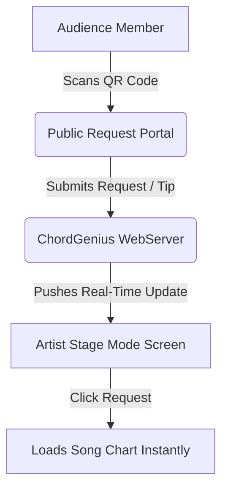

# 🎸 ChordGenius Studio: Refinement & Innovation Proposal

This proposal outlines a high-fidelity competitive research analysis, transparent monetization structures, and a collection of adventurous, creative features designed to elevate **ChordGenius Studio** into the ultimate digital platform for practicing and gigging musicians.

---

## 🔍 Part 1: Competitor Landscape & Market Gaps

To position ChordGenius as a market leader, we analyzed the dominant digital sheet music, chord repository, and rehearsal utilities. Below is a map of the market, identifying what they do well and—more importantly—where they fail.

### 📊 Competitive Comparison Matrix

| Platform | Target Audience | Pricing Model | Core Strengths | Critical Gaps & Weaknesses |
| :--- | :--- | :--- | :--- | :--- |
| **Ultimate Guitar Pro** | Amateur practice & bedroom guitarists | ~$25/mo or $99/yr (Frequent confusing sales) | Gigantic user-submitted catalog; official interactive playback; built-in metronome; mobile app. | **Predatory subscription loops** (notorious cancellation runarounds); cluttered, ad-heavy UI; poor sheet music formatting; lacks custom PDF setlist compilers; lacks ChordPro export. |
| **OnSong (iOS)** | Professional gigging musicians & bands | ~$30-50/yr (Subscription) | Industry-standard ChordPro rendering; foot pedal integration; MIDI automation (patch & light control); backing track triggers. | **Apple ecosystem lock-in** (iOS only); steep learning curve; no built-in web scraping to pull and clean tabs on the fly; outdated UI aesthetics. |
| **SongbookPro** | Cross-platform gig viewing | ~$6.99 (One-time purchase) | Clean cross-platform sync (iOS, Android, Windows); lightweight; offline support. | Lacks advanced automated intelligence (e.g., Chord Simplify, Smart Capo Optimization); no automated web search scraping; no multi-column binder assembly with automatic indices. |
| **BandHelper** | Complex band management | $15 - $100/yr (Tiered by member count) | Exceptional MIDI automation, stage cues, band synchronization, gig finance tracking. | **Extremely dated, clunky UX** (looks like 2012 Android app); overwhelming setup friction; high learning curve; poor design aesthetics. |
| **Planning Center Services** | Church worship teams | $12 - $199+/mo (Based on team size) | Powerful service planning, team scheduling, chord chart management, rehearsal audio attachment. | Heavily gated, highly expensive, and hyper-niched for churches; not useful for solo musicians, touring acts, or local garage bands. No on-the-fly search and scrape. |
| **Chordify** | Musicians learning songs by ear | ~$8.00/mo or $40/yr | Automatic chord recognition from audio/YouTube links; synchronized playback timeline. | Chords are often inaccurate; lacks lyrics parsing and alignment; no setlist or gig management; no PDF printing or ChordPro exporting features. |
| **ChartBuilder (MultiTracks)** | Worship leaders & bands | ~$5.99/mo (Solo Practice) | Dynamic key and layout controls; backing track and RehearsalMix audio integration. | Locked entirely to the MultiTracks worship catalog; highly niche; no custom song additions or web scraping. |

---

## 💡 Part 2: ChordGenius Unique Value Proposition (UVP)

ChordGenius is uniquely positioned to exploit these market gaps. By combining a **bot-resilient web scraper**, a **smart key transposition engine**, and **premium PDF/Word document compilers**, ChordGenius provides:

1. **Zero Catalog Limits:** Instantly fetch and clean any song on the internet, skipping Ultimate Guitar's ad-walled and locked printing features.
2. **Beautiful Monospaced Sheet Output:** High-fidelity multi-column and single-sheet layouts with customizable, clean metadata headers.
3. **Advanced Musician Automations:** Capo and voicing optimizer, web-audio metronome, interactive editors, and seamless ChordPro formats.
4. **Modern, Gorgeous Aesthetics:** A premium, warm-cream, glassmorphic UI that feels state-of-the-art and respects user attention (no ads, no popups).

---

## 💸 Part 3: Transparent, Honest Monetization Framework

Unlike competitors who rely on aggressive, hidden auto-renewals and complex billing funnels, ChordGenius will pioneer a **Musician-First Transparent Pricing Strategy**.

### 🌟 Pricing Tiers

> [!NOTE]
> During the current **Beta Phase**, all users are automatically upgraded to the **Pro Tier** for free, branded as **"Beta Explorer"** to incentivize feedback and community-driven testing.

```
+---------------------------------------------------------------------------------+
|                                 PRICING TIERS                                   |
+--------------------------+---------------------------+--------------------------+
|      BETA EXPLORER       |        PRO ARTIST         |      BAND SYNDICATE      |
|          $0/mo           |       $4.99/mo or $45/yr  |         $12.99/mo        |
|  * Universal Pro Access  |  * Unlimited Scrapes      |  * Everything in Pro     |
|  * Help Shape the App    |  * ChordPro Import/Export |  * Shared Setlist Sync   |
|  * Early Adopter Badge   |  * Multi-Format Binders   |  * Up to 5 synced screens|
|                          |  * Pro Glossary & Tooltips|  * Shared Band Library   |
+--------------------------+---------------------------+--------------------------+
```

### 🤝 The Anti-Predatory Billing Charter:
* **No Cancellation Loops:** A prominent, single-click "Cancel Subscription" button directly in the user profile dashboard.
* **Pre-Renewal Reminders:** An automated email sent **7 days before** an annual subscription renews, giving the user ample time to cancel if they no longer need it.
* **Pro-Rata Refunds:** If a user forgets to cancel and is charged, they can request a 100% refund within 3 days of renewal with zero questions asked.

---

## 🚀 Part 4: Adventurous & Creative Feature Proposals

Here are seven highly creative, game-changing features and dedicated pages to make ChordGenius the most powerful tool in a musician's arsenal.

### 1. 📷 "Binder Digitizer" (Image-to-ChordPro OCR Scanner)
* **Concept:** Many seasoned musicians have thick physical binders full of paper chord sheets. Manually typing these into ChordGenius is a massive chore.
* **How It Works:** A dedicated **Upload Scan Page** where the user uploads a photo or PDF scan of a paper chord sheet.
  * **Processing:** The app performs client-side OCR (using `Tesseract.js` or a lightweight backend engine) to extract the text.
  * **Formatting:** A smart parsing algorithm identifies lines containing chords vs lines containing lyrics, automatically aligning them and wrapping the chords in ChordPro brackets (e.g. `[G]Hello [C]World`).
  * **Editor Review:** The formatted song is instantly loaded into the ChordGenius interactive editor for quick review and saving.
* **Musician Value:** Saves hours of manual transcription, allowing musicians to digitize their paper library in minutes.

### 2. 🔁 "The Shred Coach" (Practice Looper & Speed Ramp)
* **Concept:** Practicing difficult sections of a song (like a guitar solo, complex bridge, or fast chord changes) requires starting slow and gradually increasing speed. Doing this manually interrupts the flow of playing.
* **How It Works:** Inside the interactive chord sheet player, musicians can select a specific section (e.g. `[Chorus]` or highlight a block of lines) and toggle "Practice Mode":
  * **Speed Ramping:** Automatically increase the tempo by a user-defined amount (e.g., +5% BPM) on each loop, starting from a slow speed (e.g. 60% of original tempo) up to full speed (110%).
  * **Key Shifting:** Automatically transpose the section up by a half-step on each loop (perfect for ear training, modulation practice, and vocal warm-ups).
  * **Visual countdown:** A subtle visual count-in flash before each loop starts.
* **Musician Value:** Accelerates motor skill learning and muscle memory without requiring hands to touch the screen.

### 🎸 3. Alternate Tuning Calculator (Tuning & Capo Lab)
* **Concept:** Guitarists often play in alternate tunings (e.g., Drop D, DADGAD, Open G, Eb Standard) or use capos. Transposing chords and figuring out the new fingerings in these tunings is complex.
* **How It Works:** Inside the ChordGenius settings, the user selects their active instrument tuning.
  * **Fretboard Voicing Re-Calculator:** The engine dynamically recalculates the exact chord diagram SVGs for the entire song based on this tuning.
  * **Tuning Tooltips:** Hovering over a chord (e.g., a `D` chord in DADGAD) reveals the customized chord diagram.
  * **Tuning-Aware Capo suggestions:** The Capo Optimizer suggests the optimal capo fret specifically for the selected alternate tuning to avoid complex finger shapes.
* **Musician Value:** Opens up ChordGenius to folk, metal, and fingerstyle guitarists who heavily utilize non-standard tunings.

### 📣 4. "Gig Request Portal" & "Live Tip Jar"
* **Concept:** Live musicians love audience interaction (requests), but managing shout-outs on stage is chaotic. Furthermore, busking and gigging musicians need easy tipping mechanisms.
* **How It Works:** A performer can generate a public request link or QR code (e.g., `chordgenius.app/artist/john-doe`).
  * **Audience View:** Fans scan the QR code to see a clean, curated list of songs the artist knows. They can request a song, vote on other audience requests, or leave a digital tip (linking to Venmo, PayPal, or Stripe).
  * **Performer View:** Inside ChordGenius, the artist has a "Live Request Panel" overlay in Stage Mode. It shows a real-time leaderboard of what songs the audience wants to hear and who tipped. With a single click, the artist can load that song directly into their active screen.
* **Musician Value:** Increases audience engagement, drives higher tips for the artist, and automates setlist decisions on the fly.



### 🎹 5. "Virtual Jam Buddy" (Web-Audio Backing Band)
* **Concept:** Playing alone with a metronome can be boring and doesn't train musicians to play with a real rhythm section. Recording backing tracks is time-consuming.
* **How It Works:** ChordGenius parses the chord sheet's ChordPro format, detects the time signature and BPM, and synthesizes a basic backing track in the browser using the Web Audio API.
  * **Drums:** A clean, synthesized drum beat (bass drum, snare, hi-hat) matched to the time signature.
  * **Harmony:** A synchronized synth bass line and keyboard chord pad backing the exact chord progression.
  * **Dynamic Controls:** The backing band dynamically updates if the musician transposes the key, changes the tempo, or toggles specific tracks (e.g. "Mute Bass" or "Drums Only").
* **Musician Value:** Provides a fully interactive, infinitely customizable backing band that runs instantly in the browser with zero external audio files.

### 👥 6. Collaborative "Stage Sync" & Multi-Device Role Display
* **Concept:** Band members need different charts. The guitarist needs chords with capo, the saxophonist needs Eb transposition, the singer needs giant lyrics, and the keyboardist needs piano voicings.
* **How It Works:** A WebSocket-driven multi-screen sync.
  * **Leader:** Casts song state, active scroll position, and BPM.
  * **Followers:** Join the session via a 4-digit code. Each follower sets their instrument "Role". The app automatically renders the active song customized for their role (e.g., Keyboardist sees piano chord charts; Guitarist sees capo fret 2; Sax player sees Bb/Eb transpositions; Singer sees clean, large-font lyrics).
* **Musician Value:** Eliminates paper setlist hand-outs, streamlines live performance changes, and accommodates multi-instrumentalists.

### 🖥️ 7. Interactive Lyric Projection Screen (The Congregation/Karaoke Mode)
* **Concept:** Acoustic acts, worship leaders, and small choirs often need to project lyrics on a screen for their audience, congregation, or backing vocalists to sing along.
* **How It Works:** A "Cast Screen" option that opens a clean, borderless browser window.
  * **Visual Presentation:** This window displays *only* the lyrics in a stylized, high-legibility design (customizable fonts, text shadows, smooth transition animations, and dark/light templates).
  * **Scrolling Sync:** As the band leader scrolls or plays, the lyrics in the projection window scroll and highlight in sync.
* **Musician Value:** Replaces expensive lyric projection software (like ProPresenter) for small-scale acoustic gigs, churches, or sing-along gatherings.

---

## 🛠️ Part 5: Implementation Roadmap & Technical Feasibility

These advanced features can be integrated incrementally into the existing Node.js and client-side stack.

```mermaid
gantt
    title ChordGenius Studio Expansion Roadmap
    dateFormat  YYYY-MM-DD
    section Phase 3: Practice & Tuning
    The Shred Coach Looper      :active, p1, 2026-06-10, 7d
    Alternate Tuning Calculator  :after p1, p2, 5d
    section Phase 4: Stage & Collaboration
    Stage Sync WebSocket Server :after p2, p3, 10d
    Lyric Projection Casting     :after p3, p4, 5d
    section Phase 5: Digital Tools & OCR
    Binder Digitizer OCR Scanner :after p4, p5, 12d
    Gig Request Portal & Tip Jar :after p5, p6, 14d
    Virtual Jam Buddy Web Synth  :after p6, p7, 10d
```

### 🔧 Tech Stack Integration Details
1. **The Shred Coach (Looper):** Pure client-side JS implementation. Uses the existing auto-scroll code and metronome timing context to loop and increment BPM/transposition.
2. **Alternate Tuning Calculator:** Can be integrated into `engine.js` (for PDF/Docx rendering) and the front-end chord glossary. Uses an algorithmic fret-distance matrix to find voicing layouts in open tunings.
3. **Stage Sync & Request Portal:** Requires running a socket listener inside `server.js` to manage room codes and broadcast events. Very lightweight, requiring no database storage if sessions are held in-memory.
4. **Binder Digitizer (OCR):** Uses `Tesseract.js` loaded client-side via CDN, coupled with a regular expression parser to map line coordinates and identify text boxes containing chords vs text boxes containing lyrics.

---

## 🗳️ Part 6: Feedback & Voting Loop

*Which of these ideas should we prototype first? Let me know your thoughts or assign priorities (High / Med / Low) for each:*

- [ ] **1. Binder Digitizer OCR Scanner** — Priority: \_\_\_\_\_\_
- [ ] **2. The Shred Coach Looper & Speed Ramp** — Priority: \_\_\_\_\_\_
- [ ] **3. Alternate Tuning Calculator** — Priority: \_\_\_\_\_\_
- [ ] **4. Gig Request Portal & Live Tip Jar** — Priority: \_\_\_\_\_\_
- [ ] **5. Virtual Jam Buddy Web Audio Synth** — Priority: \_\_\_\_\_\_
- [ ] **6. Collaborative Stage Sync** — Priority: \_\_\_\_\_\_
- [ ] **7. Lyric Projection Screen** — Priority: \_\_\_\_\_\_

---
*Created by Antigravity for ChordGenius Studio. Pair-programming towards professional musicianship.*
