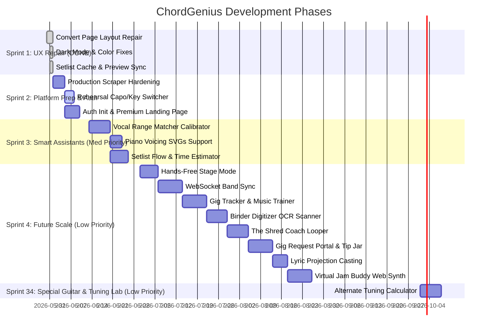

# 📋 ChordGenius Studio: Interactive Scrum Board

Welcome to the central product backlog and scrum dashboard! This board synthesizes all active development items from [next_steps.md](file:///c:/Users/Dwitt/Projects/ChordGeniusWebpage/next_steps.md) and [proposed_ideas.md](file:///c:/Users/Dwitt/Projects/ChordGeniusWebpage/proposed_ideas.md), along with your prioritizations on the new adventurous features from [future_vision_ideas.md](file:///c:/Users/Dwitt/Projects/ChordGeniusWebpage/future_vision_ideas.md).

---

## 🗺️ Product Roadmap & Sprint Schedule

---

## 🗂️ Active Kanban Board

| 📥 BACKLOG (Future Scope) | 📝 TO DO (Ready for Sprint) | ⏳ IN PROGRESS | ✅ DONE (Completed) |
| :--- | :--- | :--- | :--- |
| • Band Sync (WebSocket Sync)   • Gig Tracker & Analytics   • Dynamic Ear Trainer & Analysis   • App Conversion Research (TSK-406)   • Binder Digitizer OCR Scanner (TSK-407)   • The Shred Coach Looper (TSK-408)   • Gig Request Portal & Tip Jar (TSK-409)   • Virtual Jam Buddy Synth (TSK-410)   • Lyric Projection Screen (TSK-411)   • Alternate Tuning Calculator (TSK-3401) | • Vocal Range Matcher   • Stage Mode & Foot Pedal   • UG Direct URL Import (TSK-208)   • SVG Live Editor Sync (TSK-308)   • Rehearsal Tab Voicing Selector (TSK-309)   • Dropdown Tiles Width (TSK-210)   • Tab Whitespace Cleansing (TSK-211)   • YouTube Rehearse Integration (TSK-313)   • User-Side Import (Option B) (TSK-215) | • Production Scraper Hardening   • **Rehearsal Capo/Key Switcher**   • Login/Signup Account Init   • Setlist Flow / Time Estimator (Phase 1)   • Spotify Playlist Importer (Phase 1) | **Sprint 1 (100% Completed)**   **Sprint 2 Completed Tasks:**   • Transition Animation & Tab Routing (TSK-205)   • Multi-Source Scraping (TSK-209)   • Mobile Layout Optimization (TSK-212)   **Sprint 3 Core Phase 1:**   • **Piano Chord SVGs**   • **Active Chart Zoom Controls** (TSK-307)   • Nashville Piano SVG Toggle (TSK-312)   • Remove Inputs Toast (TSK-213)   • URL Scrape Title Resolution (TSK-214)   • **Scraped Key Verification** (TSK-310)   • **Metronome Mute Button** (TSK-314)   • **Title Underscore Fix** (TSK-311) |

---

## 🏃 Sprint Breakdowns

### 🎯 Sprint 1: Core UX Repair & Critical Fixes (Priority: High)
* **Goal:** Polish the core layout to be comfortable, fix critical visual bugs, and ensure standard operations work smoothly.
* **Status:** **🎉 100% Completed!**

- [x] **TSK-101: Convert Page Layout Restructure**
  - **Description:** Decompress layout. Remove horizontal scroller. Make the Preview pane compressible and significantly smaller by default.
  - **Status:** Completed in commit `041f94f` (implemented persistent resizable draggable sidebar panels with bound constraints).
- [x] **TSK-102: Dark Mode Font & Colors Restoration**
  - **Description:** Fix the dark mode CSS bug where text inside the Edit/Preview panels and the "Stage View/Editor" buttons becomes invisible or hard to read.
  - **Status:** Completed in commit `45a8a28` / `62786f7` (CSS consolidated with WCAG compliance contrast fixes).
- [x] **TSK-103: Header Renaming & Workspace Cleanup**
  - **Description:** Rename the top workstation title from "Workstation" to "Convert". Add a visual/text notice that the site is in Beta and everyone has the "Pro Tier" unlocked.
  - **Status:** Completed in commit `45a8a28` (headers renamed across HTML panels).
- [x] **TSK-104: Preview Modal Overlay Refactor**
  - **Description:** When a chart is active in the preview, hide the static "Chord Genius Stage" at the bottom to prevent screen space blockage. 
  - **Status:** Completed in commit `45a8a28` (placeholder panel hides dynamically when active overlay is open).
- [x] **TSK-105: Preview Controller Repositioning**
  - **Description:** Move preview action buttons (Add to Setlist, Download, Send to Rehearse) to the top right of the Preview bar, aligned vertically and styled consistently with Stage View/Editor buttons.
  - **Status:** Completed in commit `45a8a28` (action controller layout placed directly into header/tab bar).
- [x] **TSK-106: Setlist Queue Caching (`localStorage`)**
  - **Description:** Cache the current Setlist queue array in browser `localStorage` so refreshing does not wipe the active list. Add a clean "Clear Setlist" button.
  - **Status:** Completed in commit `45a8a28` (cached array loaded and updated dynamically).
- [x] **TSK-107: Setlist Card Preview Integration**
  - **Description:** Allow users to preview a specific song in the Setlist Queue directly by clicking its card in the Setlist Builder panel.
  - **Status:** Completed in commit `45a8a28` (added click preview modal events).

---

### 🔑 Sprint 2: Platform Preparation, Security & Auth (Priority: Med-High)
* **Goal:** Stabilize the platform for multi-user access, implement user account frameworks, and harden scraper capabilities.

- [X] **TSK-201: Production Scraper Evasion Hardening**
  - **Description:** Fix Ultimate Guitar scraper timeouts and Cloudflare blocks on the live domain (`chordgenius.dewittcyber.com`). Optimize proxy headers, rota user-agents, and cache search engine results.
  - **Source:** [proposed_ideas.md - Next Step 3](file:///c:/Users/Dwitt/Projects/ChordGeniusWebpage/proposed_ideas.md#L57)
- [ ] **TSK-202: Login/Signup Account Infrastructure**
  - **Description:** Implement standard user signup and login page panels, saving credential states and setting up database routes.
  - **Source:** [next_steps.md - Next step 1](file:///c:/Users/Dwitt/Projects/ChordGeniusWebpage/next_steps.md#L20)
- [ ] **TSK-203: Premium Feature Page & Gateway Simulator**
  - **Description:** Build a landing/settings page showcasing free vs. premium tiers with a premium gold UI styling, featuring a sandbox billing/upgrade simulator.
  - **Source:** [next_steps.md - Next step 2](file:///c:/Users/Dwitt/Projects/ChordGeniusWebpage/next_steps.md#L21)
- [X] **TSK-204: Rehearse Page Layout Alignment**
  - **Description:** Re-layout the Rehearse Page so it shares consistent sidebar page-selectors and structure with the Convert Page. Componentize matching modules.
  - **Source:** [next_steps.md - Bug 6](file:///c:/Users/Dwitt/Projects/ChordGeniusWebpage/next_steps.md#L16)
- [x] **TSK-205: Transition Animation & Tab Routing**
  - **Description:** Add elegant transitions when switching between tabs (Convert, Rehearse, and later Premium). Ensure consistent defaults (e.g. "Interactive Preview" active by default).
  - **Source:** [next_steps.md - Bug 7](file:///c:/Users/Dwitt/Projects/ChordGeniusWebpage/next_steps.md#L17) & [proposed_ideas.md - Next Step 7](file:///c:/Users/Dwitt/Projects/ChordGeniusWebpage/proposed_ideas.md#L61)
- [X] **TSK-206: Nashville Scrape Parser Patch**
  - **Description:** Resolve formatting bug where scraping a song that lists Nashville Numbers as the input key disrupts the conversion layout.
  - **Source:** [proposed_ideas.md - Next Step 6](file:///c:/Users/Dwitt/Projects/ChordGeniusWebpage/proposed_ideas.md#L60)
- [x] **[NEW] TSK-207: Rehearsal Tab Capo/Key Switcher**
  - **Description:** Add an interactive transposition capo/key control panel directly inside the Rehearse tab. Allow musicians to change key and capo fret on the fly during a rehearsal run without returning to Convert panel.
  - **Source:** [Notion ChordGenius Hub Ideas](file:///c:/Users/Dwitt/Projects/ChordGeniusWebpage/docs/scrum_board.md)
- [x] **[NEW] TSK-208: Ultimate Guitar Direct URL Import**
  - **Description:** Add an ability for the user to be able to insert a link to ultimate guitar and pull tabs that way.
  - **Source:** [Notion ChordGenius Hub Ideas](file:///c:/Users/Dwitt/Projects/ChordGeniusWebpage/docs/scrum_board.md)
- [x] **[NEW] TSK-209: Multi-Source Scraping Research & Fallbacks**
  - **Description:** Research alternative chord sheet directories (e.g., e-chords, chordie) to bypass Ultimate Guitar Cloudflare blocks and implement them as fallback scrapers.
  - **Source:** [Notion ChordGenius Hub Ideas](file:///c:/Users/Dwitt/Projects/ChordGeniusWebpage/docs/scrum_board.md)
- [x] **[NEW] TSK-210: Dropdown Tiles Width & Panel Initial Sizing**
  - **Description:** Default width of the dropdown tiles for the widgets doesn’t display enough text. The sliding panel should by default start 3/4 of the way to the right to allow room for the tiles to be able to display their text.
  - **Source:** [Notion ChordGenius Hub Ideas](file:///c:/Users/Dwitt/Projects/ChordGeniusWebpage/docs/scrum_board.md)
- [x] **[NEW] TSK-211: Scraped Tab Whitespace Cleansing & Formatting**
  - **Description:** Some scrapes are inserting a lot of white space. Add a way to make sure the formatting looks good.
  - **Source:** [Notion ChordGenius Hub Ideas](file:///c:/Users/Dwitt/Projects/ChordGeniusWebpage/docs/scrum_board.md)
- [x] **[NEW] TSK-212: Mobile Layout Optimization**
  - **Description:** Implement an alternate layout for mobile phone to keep sleek look but more optimal for mobile use.
  - **Source:** [Notion ChordGenius Hub Ideas](file:///c:/Users/Dwitt/Projects/ChordGeniusWebpage/docs/scrum_board.md)
- [x] **[NEW] TSK-213: Remove Inputs Changed Conversion Toast**
  - **Description:** Get rid of the “Inputs changed - please convert again” toast.
  - **Source:** [Notion ChordGenius Hub Ideas](file:///c:/Users/Dwitt/Projects/ChordGeniusWebpage/docs/scrum_board.md)
- [x] **[NEW] TSK-214: URL Scraped Title Resolution & Editable Title Preview**
  - **Description:** If scraping using a URL, the song title should be extracted from the scraped page content rather than using the raw URL. Additionally, make the title editable in the Convert Page so that downloaded files use the customized title.
  - **Source:** [Notion ChordGenius Hub Ideas](file:///c:/Users/Dwitt/Projects/ChordGeniusWebpage/docs/scrum_board.md)
- [ ] **[NEW] TSK-215: User-Side Client-Only Import (Option B)**
  - **Description:** Shift the scraping responsibility from the backend server to the client's browser (e.g. via a browser extension or client-side copy-paste importer script) so the user logs in and imports songs locally, protecting ChordGenius from direct copyright distribution liability.
  - **Source:** [Legal Risk Assessment (Option B)](file:///c:/Users/Dwitt/Projects/ChordGeniusWebpage/docs/refinement_innovation_proposal.md)

---

### 🎨 Sprint 3: Intelligent Assistant Suites (Priority: Medium)
* **Goal:** Launch the two high-impact intelligent features selected by you to elevate practicing and gig preparation.

- [ ] **TSK-301: Vocal Range Matcher & Calibration Panel**
  - **Description:** Build the microphone-based voice calibration utility. Calibrate high and low notes using a fast browser autocorrelation frequency algorithm, store range in profile, and auto-transpose loaded sheets to the singer's "Golden Key."
  - **Source:** [future_vision_ideas.md - Feature 1 (Med Priority)](file:///c:/Users/Dwitt/Projects/ChordGeniusWebpage/future_vision_ideas.md)
- [ ] **TSK-302: Setlist Flow & Time Estimator**
  - **Description:** Estimate setlist duration using Spotify API track lengths or chord metric speeds. Add interactive timeline blocks for non-musical actions (tuning/talking) and display visual alerts for jarring key shifts between consecutive songs.
  - **Progress:** Phase 1 Completed: Implemented Circle of Fifths circular transition distance analysis & interactive transpositions remedies.
  - **Source:** [future_vision_ideas.md - Feature 4 (Med Priority)](file:///c:/Users/Dwitt/Projects/ChordGeniusWebpage/future_vision_ideas.md)
- [x] **TSK-303: Options Reset Buttons**
  - **Description:** Add standard "Reset Settings" buttons to the *Search & Convert* and *Upload & Convert* configuration grids to allow rapid standard state restores.
  - **Source:** [proposed_ideas.md - Next Step 2](file:///c:/Users/Dwitt/Projects/ChordGeniusWebpage/proposed_ideas.md#L56)
- [x] **TSK-304: Custom Binder Title Dynamic Alignment**
  - **Description:** Fix PDF/Word binder cover generation so it reads the user's custom binder name instead of outputting the default "SETLIST BINDER".
  - **Source:** [proposed_ideas.md - Next Step 8](file:///c:/Users/Dwitt/Projects/ChordGeniusWebpage/proposed_ideas.md#L64)
- [x] **[NEW] TSK-305: Piano Chord Voicing Diagram Support**
  - **Description:** Expand the visual chord tooltip voicing engine. In addition to guitar fretboard diagrams, add a togglable option to render standard piano keys highlighting finger positions for the active hover chord.
  - **Progress:** 100% Completed: Integrated 2-octave piano keyboard SVG visualizer, localStorage persistence, and theme-aware CSS modes.
  - **Source:** [Notion ChordGenius Hub Ideas](file:///c:/Users/Dwitt/Projects/ChordGeniusWebpage/scrum_board.md)
- [ ] **[NEW] TSK-306: Spotify Playlist Setlist Importer**
  - **Description:** Allow users to import a Spotify playlist (capped at max 15 songs) directly into the Convert tab to automatically generate a setlist binder. Build a bulk-configuration screen where users can customize key transpositions, capos, simplifies, and formatting details for each song before triggering the scrape pipeline.
  - **Progress:** Phase 1 Completed: Implemented Express POST `/api/spotify/playlist-import` handling track metadata, audio analysis keys, and pagination.
  - **Source:** [Notion ChordGenius Hub Ideas](file:///c:/Users/Dwitt/Projects/ChordGeniusWebpage/scrum_board.md)
- [x] **[NEW] TSK-307: Active Chart Text Zoom Controls**
  - **Description:** Add + (Zoom In) and - (Zoom Out) controls to allow musicians to dynamically adjust font size on the interactive preview (Convert tab) and the rehearsal sheet (Rehearse tab) for optimal stage readability.
  - **Source:** [Notion ChordGenius Hub Ideas](file:///c:/Users/Dwitt/Projects/ChordGeniusWebpage/docs/scrum_board.md)
- [x] **[NEW] TSK-308: SVG Live Editor Sync**
  - **Description:** If a Chord is changed in the edit preview, the SVG should be updated.
  - **Source:** [Notion ChordGenius Hub Ideas](file:///c:/Users/Dwitt/Projects/ChordGeniusWebpage/docs/scrum_board.md)
- [x] **[NEW] TSK-309: Rehearsal Tab Voicing Selector**
  - **Description:** User should be able to change the Voicing Mode in the Rehearse Tab.
  - **Source:** [Notion ChordGenius Hub Ideas](file:///c:/Users/Dwitt/Projects/ChordGeniusWebpage/docs/scrum_board.md)
- [x] **[NEW] TSK-310: Scraped Key Verification & Warning**
  - **Description:** Detect when a song might have the wrong key scraped and deliver a warning to the user.
  - **Source:** [Notion ChordGenius Hub Ideas](file:///c:/Users/Dwitt/Projects/ChordGeniusWebpage/docs/scrum_board.md)
- [x] **[NEW] TSK-311: Title Space Underscore Sanitization**
  - **Description:** Titles should always have spaces not underscores, verify this and fix it.
  - **Source:** [Notion ChordGenius Hub Ideas](file:///c:/Users/Dwitt/Projects/ChordGeniusWebpage/docs/scrum_board.md)
- [x] **[NEW] TSK-312: Hide Piano SVGs in Nashville Mode**
  - **Description:** Piano SVGs should not display if in Nashville Number system.
  - **Source:** [Notion ChordGenius Hub Ideas](file:///c:/Users/Dwitt/Projects/ChordGeniusWebpage/docs/scrum_board.md)
- [ ] **[NEW] TSK-313: Rehearsal Tab YouTube Video Integration**
  - **Description:** In Rehearse, similar to how ultimate guitar has it, I want a youtube link to the song able to be played while rehearsing. This can maybe be done by using the initial scrape from UG and grab the youtube link.
  - **Source:** [Notion ChordGenius Hub Ideas](file:///c:/Users/Dwitt/Projects/ChordGeniusWebpage/docs/scrum_board.md)
- [x] **[NEW] TSK-314: Rehearse Metronome Audio Mute Button**
  - **Description:** There should be a mute button for the metronome so that autoscroll may progress without the sound.
  - **Source:** [Notion ChordGenius Hub Ideas](file:///c:/Users/Dwitt/Projects/ChordGeniusWebpage/docs/scrum_board.md)

---

### 🚀 Sprint 4: Future Vision Expansion (Priority: Low)
* **Goal:** Introduce full band synchronization, specialized stage modes, and supplementary practice utilities to capture advanced market sectors.

- [ ] **TSK-401: Hands-Free "Stage Mode" Interface**
  - **Description:** Construct a dedicated full-screen Stage View with enlarged chord text, support for Bluetooth page-turning foot pedals, and a silent visual metronome border flash.
  - **Source:** [future_vision_ideas.md - Feature 2 (Low Priority)](file:///c:/Users/Dwitt/Projects/ChordGeniusWebpage/future_vision_ideas.md)
- [ ] **TSK-402: WebSocket "Band Sync" Network**
  - **Description:** Create multi-user session rooms allowing band members to sync scrolling, active songs, and customized instruments transpositions on the fly with <50ms delays.
  - **Source:** [future_vision_ideas.md - Feature 3 (Low Priority)](file:///c:/Users/Dwitt/Projects/ChordGeniusWebpage/future_vision_ideas.md)
- [ ] **TSK-403: Dynamic Ear Trainer & Roman Numeral Analyzer**
  - **Description:** Map active chords to Roman Numerals and Nashville numbers in a togglable sheet analysis sidebar. Implement interactive guitar fretboards/piano overlays highlighting harmonic heatmaps.
  - **Source:** [future_vision_ideas.md - Feature 5 (Low Priority)](file:///c:/Users/Dwitt/Projects/ChordGeniusWebpage/future_vision_ideas.md)
- [ ] **TSK-404: Gig Tracker & Business Hub**
  - **Description:** Construct a logs panel tracking date, payout, venue, and setlists. Display charts charting song frequencies and average set metrics.
  - **Source:** [future_vision_ideas.md - Feature 6 (Low Priority)](file:///c:/Users/Dwitt/Projects/ChordGeniusWebpage/future_vision_ideas.md)
- [ ] **TSK-405: Domain Acquisition Research**
  - **Description:** Investigate pricing and registrar options for purchasing `chordgenius.com` or alternative top-level domains.
  - **Source:** [proposed_ideas.md - Next Step 4](file:///c:/Users/Dwitt/Projects/ChordGeniusWebpage/proposed_ideas.md#L58)
- [ ] **[NEW] TSK-406: Native App Conversion Research**
  - **Description:** Look into making this into an app.
  - **Source:** [Notion ChordGenius Hub Ideas](file:///c:/Users/Dwitt/Projects/ChordGeniusWebpage/docs/scrum_board.md)
- [ ] **[NEW] TSK-407: Binder Digitizer OCR Scanner**
  - **Description:** Upload photos/scans of paper chord sheets, run client-side OCR (Tesseract.js), parse into structured ChordPro markup, and load in the editor.
  - **Source:** [refinement_innovation_proposal.md - Feature 1](file:///c:/Users/Dwitt/Projects/ChordGeniusWebpage/docs/refinement_innovation_proposal.md)
- [ ] **[NEW] TSK-408: The Shred Coach Looper & Speed Ramp**
  - **Description:** Loop selected chord sheet sections with automatic tempo ramping (+5% BPM per cycle) or pitch modulation (modulating keys).
  - **Source:** [refinement_innovation_proposal.md - Feature 2](file:///c:/Users/Dwitt/Projects/ChordGeniusWebpage/docs/refinement_innovation_proposal.md)
- [ ] **[NEW] TSK-409: Gig Request Portal & Live Tip Jar**
  - **Description:** Create a public-facing artist request portal with Venmo/Stripe tips, feeding requested songs in real-time to the active Stage Mode screen.
  - **Source:** [refinement_innovation_proposal.md - Feature 4](file:///c:/Users/Dwitt/Projects/ChordGeniusWebpage/docs/refinement_innovation_proposal.md)
- [ ] **[NEW] TSK-410: Virtual Jam Buddy Web Audio Synth**
  - **Description:** Synthesize interactive MIDI backing tracks (drums, bass, pads) using browser Web Audio API, adjusting dynamically to tempo and keys.
  - **Source:** [refinement_innovation_proposal.md - Feature 5](file:///c:/Users/Dwitt/Projects/ChordGeniusWebpage/docs/refinement_innovation_proposal.md)
- [ ] **[NEW] TSK-411: Lyric Projection Screen (Congregation Mode)**
  - **Description:** Open a secondary borderless window projecting large, clean, auto-scrolling lyrics for live sing-alongs, cast from the band leader's screen.
  - **Source:** [refinement_innovation_proposal.md - Feature 7](file:///c:/Users/Dwitt/Projects/ChordGeniusWebpage/docs/refinement_innovation_proposal.md)

---

### 🌀 Sprint 34: Special Guitar & Tuning Lab (Priority: Low)
* **Goal:** Expand instrument-specific chord voicing engines to support alternate guitar and string tunings.

- [ ] **TSK-3401: Alternate Tuning Calculator (Tuning & Capo Lab)**
  - **Description:** Algorithmic voicing recalculator for non-standard guitar tunings (Drop D, DADGAD, Open G, Eb Standard) with custom SVG diagram rendering.
  - **Source:** [refinement_innovation_proposal.md - Feature 3](file:///c:/Users/Dwitt/Projects/ChordGeniusWebpage/docs/refinement_innovation_proposal.md)

---

*Created by Antigravity. Check off tasks as you execute to maintain perfect development coordination.*
