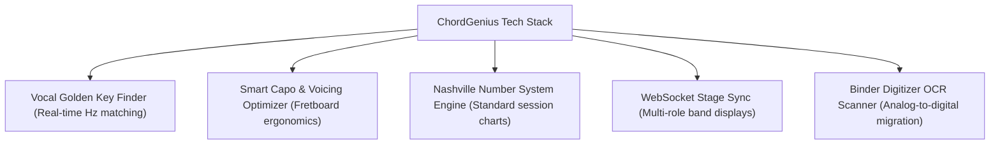

# 🎸 Muse Group / Ultimate Guitar Acquisition Strategy

This document outlines the strategic positioning of **ChordGenius Studio** for a potential acquisition pitch to **Muse Group** (the parent company of Ultimate Guitar, MuseScore, Audacity, StaffPad, and Hal Leonard). It addresses the legal risks of web scraping, target positioning, and how to frame the product as an indispensable asset to their ecosystem.

---

## 1. 🔍 The Muse Group Portfolio Analysis
Muse Group has spent the last decade building a dominant, end-to-end digital sheet music and audio workstation empire. Their portfolio consists of:
*   **Ultimate Guitar (UG):** Crowdsourced chord sheets and guitar tabs (millions of users).
*   **MuseScore:** Professional desktop notation software (MuseScore Studio) and sheet music community (MuseScore.com).
*   **Audacity:** The world’s most popular open-source audio editing software.
*   **StaffPad:** An advanced hand-written notation app for tablets.
*   **Hal Leonard (Acquired late 2023):** The world’s largest print music publisher, giving Muse Group the rights to license official sheet music for almost every major song catalog in existence.

### ⚠️ The Critical Portfolio Gap: **Live Performance & Gigging**
While Muse Group dominates **creation** (Audacity, MuseScore, StaffPad) and **catalog cataloging** (Ultimate Guitar, Hal Leonard), they **do not own a professional on-stage chord sheet viewer or band-sync tool**. 
*   Musicians practicing at home use Ultimate Guitar.
*   Musicians performing live on stage immediately switch to **OnSong** (iOS), **SongbookPro**, or **Planning Center Services** (worship teams) because Ultimate Guitar's interface is cluttered, ad-heavy, lacks setlist binding, and does not support MIDI/foot pedal automation.
*   **ChordGenius is positioned to fill this exact gap.**

---

## 2. ⚡ The "Scraper Catch-22" (How NOT to Pitch)
Approaching Ultimate Guitar with a tool that scrapes their website is an immediate legal threat.
*   **The Risk:** If you pitch ChordGenius as a "cleaner Ultimate Guitar reader," they will view you as a parasite exploiting their data. Instead of acquiring you, they will issue a Cease & Desist for Terms of Service (ToS) violations, block your scraping proxies, and sue for copyright/CFAA violations.
*   **The Pivot:** You must **sanitize the scraping technology** for the pitch. 
    1.  **Remove Scraping from the Pitch:** Never show ChordGenius scraping Ultimate Guitar during demos. Use public-domain songs (traditional folk, Christmas carols) or mock charts.
    2.  **Frame it as an API Client:** Present ChordGenius as a *premium rendering client* designed to connect directly to Ultimate Guitar's database or official API upon acquisition. 
    3.  **Position as an Upsell:** Frame it as a premium add-on to their existing **Ultimate Guitar Pro** subscription tier (e.g., *"Ultimate Guitar Pro: Studio Edition"*).

---

## 3. 🎯 The Pitch: What Intellectual Property Are They Buying?
When pitching to Muse Group, focus on the proprietary, advanced algorithms and tools that ChordGenius provides which they do not have:

### 🎹 A. Multi-Role Band Synchronization (Stage Sync)
*   UG Pro is built for solo guitar practice. It has no team play.
*   **ChordGenius** allows a band leader to sync the screens of the singer (large lyrics), keyboardist (piano chord voicings), and guitarist (capo fret transposition) in real time.

### 🔢 B. The Nashville Number System Engine
*   Professional studio and gigging musicians frequently perform using Nashville Numbers rather than standard chords to allow instant transpositions. 
*   ChordGenius transposes and formats chords into this standard cleanly.

### 📷 C. The Binder Digitizer (Analog-to-Digital Migration)
*   Musicians have physical binders containing hundreds of pages of printed music.
*   ChordGenius uses client-side OCR (`Tesseract.js`) to digitize physical pages, automatically splitting chords and lyrics into editable ChordPro formatting. This allows musicians to migrate their analog library into Muse Group's digital ecosystem.

### 🗣️ D. The Vocal Range Matcher & Golden Key Finder
*   A microphone calibration utility that finds the musician’s vocal ceiling and floor and transposes any chart to fit their personal range.

---

## 4. 📈 Strategic Path to Acquisition
To position ChordGenius as a viable acquisition target, follow this rollout plan:

1.  **Pivot to "Bring-Your-Own-Content" (SaaS Tool):**
    Remove server-side scraping. Rebrand as a premium digital rehearsal and stage binder tool where users import or scan their own charts. This protects you under the **DMCA Safe Harbor**.
2.  **Acquire Active Users & MRR:**
    Market to gigging guitarists and worship leaders. Build a dedicated user base that actively complains about the limitations of OnSong, SongbookPro, and Ultimate Guitar.
3.  **Initiate Outreach:**
    Reach out to Muse Group's Corporate Development team. Pitch ChordGenius as a product acquisition to capture the professional gigging market, leveraging their newly acquired **Hal Leonard** sheet music catalog to feed into ChordGenius's premium stage-sync display engine.
