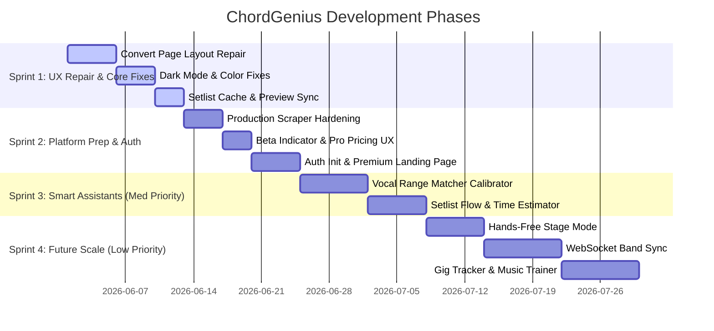

# 📋 ChordGenius Studio: Interactive Scrum Board

Welcome to the central product backlog and scrum dashboard! This board synthesizes all active development items from [next_steps.md](file:///c:/Users/Dwitt/Projects/ChordGeniusWebpage/next_steps.md) and [proposed_ideas.md](file:///c:/Users/Dwitt/Projects/ChordGeniusWebpage/proposed_ideas.md), along with your prioritizations on the new adventurous features from [future_vision_ideas.md](file:///c:/Users/Dwitt/Projects/ChordGeniusWebpage/future_vision_ideas.md).

---

## 🗺️ Product Roadmap & Sprint Schedule

---

## 🗂️ Active Kanban Board

| 📥 BACKLOG (Future Scope) | 📝 TO DO (Ready for Sprint) | ⏳ IN PROGRESS | ✅ DONE (Completed) |
| :--- | :--- | :--- | :--- |
| • Band Sync (WebSocket Sync)   • Gig Tracker & Analytics   • Dynamic Ear Trainer & Analysis | • Vocal Range Matcher   • Setlist Flow / Time Estimator   • Stage Mode & Foot Pedal | • Convert Page Layout Repair   • Preview Modal Overlay Refactor   • Preview Controller Repositioning | • Dark Mode & Colors Restored   • Workspace renamed to "Convert"   • Setlist Queue Caching   • Setlist Card Preview Click   • Options Reset Buttons   • Binder Custom Title Sync |

---

## 🏃 Sprint Breakdowns

### 🎯 Sprint 1: Core UX Repair & Critical Fixes (Priority: High)
* **Goal:** Polish the core layout to be comfortable, fix critical visual bugs, and ensure standard operations work smoothly.

- [ ] **TSK-101: Convert Page Layout Restructure**
  - **Description:** Decompress layout. Remove horizontal scroller. Make the Preview pane compressible and significantly smaller by default.
  - **Source:** [next_steps.md - Bug 1](file:///c:/Users/Dwitt/Projects/ChordGeniusWebpage/next_steps.md#L10)
- [x] **TSK-102: Dark Mode Font & Colors Restoration**
  - **Description:** Fix the dark mode CSS bug where text inside the Edit/Preview panels and the "Stage View/Editor" buttons becomes invisible or hard to read.
  - **Source:** [next_steps.md - Bug 2](file:///c:/Users/Dwitt/Projects/ChordGeniusWebpage/next_steps.md#L12) & [proposed_ideas.md - Next Step 7](file:///c:/Users/Dwitt/Projects/ChordGeniusWebpage/proposed_ideas.md#L61)
  - **Status:** Verified completed in commit `45a8a28` (CSS extracted to consolidated `public/styles.css` with accessibility overrides).
- [x] **TSK-103: Header Renaming & Workspace Cleanup**
  - **Description:** Rename the top workstation title from "Workstation" to "Convert". Add a visual/text notice that the site is in Beta and everyone has the "Pro Tier" unlocked.
  - **Source:** [next_steps.md - Bug 3 & Step 3](file:///c:/Users/Dwitt/Projects/ChordGeniusWebpage/next_steps.md#L13)
  - **Status:** Verified completed in commit `45a8a28` (workstation title cleanups applied across HTML panels).
- [ ] **TSK-104: Preview Modal Overlay Refactor**
  - **Description:** When a chart is active in the preview, hide the static "Chord Genius Stage" at the bottom to prevent screen space blockage. 
  - **Source:** [next_steps.md - Bug 4](file:///c:/Users/Dwitt/Projects/ChordGeniusWebpage/next_steps.md#L14)
- [ ] **TSK-105: Preview Controller Repositioning**
  - **Description:** Move preview action buttons (Add to Setlist, Download, Send to Rehearse) to the top right of the Preview bar, aligned vertically and styled consistently with Stage View/Editor buttons.
  - **Source:** [next_steps.md - Bug 5](file:///c:/Users/Dwitt/Projects/ChordGeniusWebpage/next_steps.md#L15)
- [x] **TSK-106: Setlist Queue Caching (`localStorage`)**
  - **Description:** Cache the current Setlist queue array in browser `localStorage` so refreshing does not wipe the active list. Add a clean "Clear Setlist" button.
  - **Source:** [proposed_ideas.md - Next Step 1](file:///c:/Users/Dwitt/Projects/ChordGeniusWebpage/proposed_ideas.md#L55)
  - **Status:** Verified completed in commit `45a8a28` (setlistQueue array fully cached as `cg_setlist` with clear button hooked).
- [x] **TSK-107: Setlist Card Preview Integration**
  - **Description:** Allow users to preview a specific song in the Setlist Queue directly by clicking its card in the Setlist Builder panel.
  - **Source:** [proposed_ideas.md - Next Step 5](file:///c:/Users/Dwitt/Projects/ChordGeniusWebpage/proposed_ideas.md#L59)
  - **Status:** Verified completed in commit `45a8a28` (hooked `previewSongFromSetlist` click triggers on compiled setlist render loops).

---

### 🔑 Sprint 2: Platform Preparation, Security & Auth (Priority: Med-High)
* **Goal:** Stabilize the platform for multi-user access, implement user account frameworks, and harden scraper capabilities.

- [ ] **TSK-201: Production Scraper Evasion Hardening**
  - **Description:** Fix Ultimate Guitar scraper timeouts and Cloudflare blocks on the live domain (`chordgenius.dewittcyber.com`). Optimize proxy headers, rota user-agents, and cache search engine results.
  - **Source:** [proposed_ideas.md - Next Step 3](file:///c:/Users/Dwitt/Projects/ChordGeniusWebpage/proposed_ideas.md#L57)
- [ ] **TSK-202: Login/Signup Account Infrastructure**
  - **Description:** Implement standard user signup and login page panels, saving credential states and setting up database routes.
  - **Source:** [next_steps.md - Next step 1](file:///c:/Users/Dwitt/Projects/ChordGeniusWebpage/next_steps.md#L20)
- [ ] **TSK-203: Premium Feature Page & Gateway Simulator**
  - **Description:** Build a landing/settings page showcasing free vs. premium tiers with a premium gold UI styling, featuring a sandbox billing/upgrade simulator.
  - **Source:** [next_steps.md - Next step 2](file:///c:/Users/Dwitt/Projects/ChordGeniusWebpage/next_steps.md#L21)
- [ ] **TSK-204: Rehearse Page Layout Alignment**
  - **Description:** Re-layout the Rehearse Page so it shares consistent sidebar page-selectors and structure with the Convert Page. Componentize matching modules.
  - **Source:** [next_steps.md - Bug 6](file:///c:/Users/Dwitt/Projects/ChordGeniusWebpage/next_steps.md#L16)
- [ ] **TSK-205: Transition Animation & Tab Routing**
  - **Description:** Add elegant transitions when switching between tabs (Convert, Rehearse, and later Premium). Ensure consistent defaults (e.g. "Interactive Preview" active by default).
  - **Source:** [next_steps.md - Bug 7](file:///c:/Users/Dwitt/Projects/ChordGeniusWebpage/next_steps.md#L17) & [proposed_ideas.md - Next Step 7](file:///c:/Users/Dwitt/Projects/ChordGeniusWebpage/proposed_ideas.md#L61)
- [ ] **TSK-206: Nashville Scrape Parser Patch**
  - **Description:** Resolve formatting bug where scraping a song that lists Nashville Numbers as the input key disrupts the conversion layout.
  - **Source:** [proposed_ideas.md - Next Step 6](file:///c:/Users/Dwitt/Projects/ChordGeniusWebpage/proposed_ideas.md#L60)

---

### 🎨 Sprint 3: Intelligent Assistant Suites (Priority: Medium)
* **Goal:** Launch the two high-impact intelligent features selected by you to elevate practicing and gig preparation.

- [ ] **TSK-301: Vocal Range Matcher & Calibration Panel**
  - **Description:** Build the microphone-based voice calibration utility. Calibrate high and low notes using a fast browser autocorrelation frequency algorithm, store range in profile, and auto-transpose loaded sheets to the singer's "Golden Key."
  - **Source:** [future_vision_ideas.md - Feature 1 (Med Priority)](file:///c:/Users/Dwitt/Projects/ChordGeniusWebpage/future_vision_ideas.md)
- [ ] **TSK-302: Setlist Flow & Time Estimator**
  - **Description:** Estimate setlist duration using Spotify API track lengths or chord metric speeds. Add interactive timeline blocks for non-musical actions (tuning/talking) and display visual alerts for jarring key shifts between consecutive songs.
  - **Source:** [future_vision_ideas.md - Feature 4 (Med Priority)](file:///c:/Users/Dwitt/Projects/ChordGeniusWebpage/future_vision_ideas.md)
- [x] **TSK-303: Options Reset Buttons**
  - **Description:** Add standard "Reset Settings" buttons to the *Search & Convert* and *Upload & Convert* configuration grids to allow rapid standard state restores.
  - **Source:** [proposed_ideas.md - Next Step 2](file:///c:/Users/Dwitt/Projects/ChordGeniusWebpage/proposed_ideas.md#L56)
  - **Status:** Verified completed in commit `45a8a28` (implemented reset elements on both conversion dashboards).
- [x] **TSK-304: Custom Binder Title Dynamic Alignment**
  - **Description:** Fix PDF/Word binder cover generation so it reads the user's custom binder name instead of outputting the default "SETLIST BINDER".
  - **Source:** [proposed_ideas.md - Next Step 8](file:///c:/Users/Dwitt/Projects/ChordGeniusWebpage/proposed_ideas.md#L64)
  - **Status:** Verified completed in commit `45a8a28` (mapped custom title input fields dynamically in Compiled downloads).

---

### 🚀 Sprint 4: Future Vision Expansion (Priority: Low)
* **Goal:** Introduce full band synchronization, specialized stage modes, and supplementary practice utilities to capture advanced market sectors.

- [ ] **TSK-401: Hands-Free "Stage Mode" Interface**
  - **Description:** Construct a dedicated full-screen Stage View with enlarged chord text, support for Bluetooth page-turning foot pedals, and a silent visual metronome border flash.
  - **Source:** [future_vision_ideas.md - Feature 2 (Low Priority)](file:///c:/Users/Dwitt/Projects/ChordGeniusWebpage/future_vision_ideas.md)
- [ ] **TSK-402: WebSocket "Band Sync" Network**
  - **Description:** Create multi-user session rooms allowing band members to sync scrolling, active songs, and customized instruments transpositions on the fly with <50ms delays.
  - **Source:** [future_vision_ideas.md - Feature 3 (Low Priority)](file:///c:/Users/Dwitt/Projects/ChordGeniusWebpage/future_vision_ideas.md)
- [ ] **TSK-403: Dynamic Ear Trainer & Roman Numeral Analyzer**
  - **Description:** Map active chords to Roman Numerals and Nashville numbers in a togglable sheet analysis sidebar. Implement interactive guitar fretboards/piano overlays highlighting harmonic heatmaps.
  - **Source:** [future_vision_ideas.md - Feature 5 (Low Priority)](file:///c:/Users/Dwitt/Projects/ChordGeniusWebpage/future_vision_ideas.md)
- [ ] **TSK-404: Gig Tracker & Business Hub**
  - **Description:** Construct a logs panel tracking date, payout, venue, and setlists. Display charts charting song frequencies and average set metrics.
  - **Source:** [future_vision_ideas.md - Feature 6 (Low Priority)](file:///c:/Users/Dwitt/Projects/ChordGeniusWebpage/future_vision_ideas.md)
- [ ] **TSK-405: Domain Acquisition Research**
  - **Description:** Investigate pricing and registrar options for purchasing `chordgenius.com` or alternative top-level domains.
  - **Source:** [proposed_ideas.md - Next Step 4](file:///c:/Users/Dwitt/Projects/ChordGeniusWebpage/proposed_ideas.md#L58)

---

*Created by Antigravity. Check off tasks as you execute to maintain perfect development coordination.*
