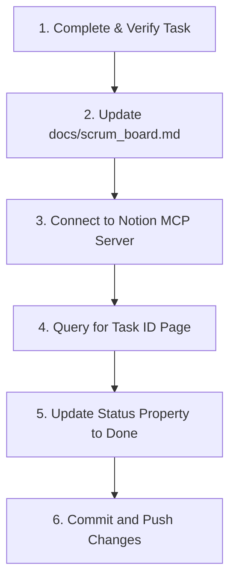

# 🎓 Skill: Scrum Board Synchronization & Status Update Workflow

This document outlines the standard operational procedure for marking development tasks as complete. To maintain perfect alignment between the codebase and product tracking, developer and verifier agents MUST synchronize statuses across both the local documentation board and the external Notion database.

---

## 📋 The Status Update Workflow



---

## 📑 Step 1: Updating the Local Scrum Board

1.  Open the local file [docs/scrum_board.md](file:///c:/Users/Dwitt/Projects/ChordGeniusWebpage/docs/scrum_board.md).
2.  Locate the completed Task ID (e.g. `TSK-201`) in the active sprint section.
3.  Change its markdown checkbox from `[ ]` or `[/]` to `[x]`.
4.  Move the task entry in the **Active Kanban Board** table from `⏳ IN PROGRESS` or `📝 TO DO` to `✅ DONE (Completed)`.

---

## 🌐 Step 2: Updating the Notion Scrum Board via MCP Server

ChordGenius uses an interactive Notion Scrum Board located at:
`https://www.notion.so/ChordGenius-Interactive-Scrum-Board-371d7bb87f1b81439181f3b9b068249b`
Database ID: `371d7bb87f1b81439181f3b9b068249b`

Agents equipped with `notion-mcp-server` must perform the following calls programmatically:

### 1. Find the Task Page
Call `API-post-search` or `API-query-data-source` with a query or filter matching the Task ID (e.g., search query: `"TSK-201"`):

```json
{
  "ServerName": "notion-mcp-server",
  "ToolName": "API-post-search",
  "Arguments": {
    "query": "TSK-201"
  }
}
```

### 2. Patch the Task Status
Retrieve the target Page ID from the search results, and call `API-patch-page` to update the `Status` selection property to `"Done"` (or check the exact property name on the database):

```json
{
  "ServerName": "notion-mcp-server",
  "ToolName": "API-patch-page",
  "Arguments": {
    "page_id": "YOUR_RETRIEVED_PAGE_ID",
    "properties": {
      "Status": {
        "status": {
          "name": "Done"
        }
      }
    }
  }
}
```

---

## 💡 Guidelines for Future Development Agents

*   **Prompt Compliance**: Never skip updating the Notion board. If credentials or keys are missing for the Notion MCP integration, report it to the user immediately after updating the local `docs/scrum_board.md`.
*   **Atomic Commits**: The local scrum board status changes should be committed in the same git log batch as the task verification.

> [!NOTE]
> **Dynamic Skill Creation & Maintenance**: As new features, subsystems, or workflows are established (e.g. databases, payment flows, or advanced authentication), developer agents are encouraged and authorized to create new skill documentation files in the `skills/` directory.
> **Self-Updating Codebase:** Whenever you add new functionality, expand APIs, or change layouts, you MUST update the corresponding skill documentation files (like `backend_and_scraper_skill.md` or `frontend_and_styling_skill.md`) to keep them current. This prevents the documentation from decaying and maintains low-token efficiency.

---
*Created by Antigravity. To update Scrum states or synchronize active backlogs, open this file with IsSkillFile: true.*
