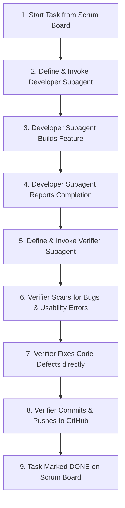

# 🎓 Skill: High-Fidelity Subagent Lifecycle & Verification Workflow

This document defines the official, high-fidelity operational workflow for executing ChordGenius development tasks using a dual-agent structure: a **Developer Subagent** and a **Verifier Subagent**. This workflow guarantees maximum code quality, visual consistency, error mitigation, and seamless Git deployment.

---

## 🔄 The Dual-Agent Workflow Overview



---

## 📋 Operational Phase Instructions

### 🛠️ Phase 1: Creating the Developer Subagent
Whenever a coding or layout task (from [scrum_board.md](file:///c:/Users/Dwitt/Projects/ChordGeniusWebpage/scrum_board.md)) is executed, the parent agent MUST spawn a specialized subagent using `define_subagent` and `invoke_subagent`.

1. **System Prompt Strategy:** Define the subagent with a hyper-focused role (e.g., `Style Optimizer`, `Metronome Engineer`, `Database Architect`). Equip it with write tools and custom instructions.
2. **Actionable Prompt Construction:** The invocation prompt must be incredibly thorough and include:
   * **Goal:** A concise summary of what must be built.
   * **Target Files:** Explicit paths to edit.
   * **Strategy:** Step-by-step breakdown of how the subagent should approach the task.
   * **UX/Aesthetic Rules:** Specific CSS color tokens, Outfit typography, or spacing constraints.

#### 📝 Code Template: Defining & Invoking Developer Subagent
```json
// Example: Spawning the Convert Page Restructure Developer
{
  "Action": "define_subagent",
  "name": "convert_page_developer",
  "description": "Specialized frontend developer focusing on decompressing page layouts and managing preview pane responsiveness.",
  "system_prompt": "You are a senior frontend engineer specializing in responsive, premium HSL CSS layouts and Outfit typography. Your goal is to optimize layouts, remove compressed styles, and maintain clean CSS tokens.",
  "enable_write_tools": true
}

{
  "Action": "invoke_subagent",
  "Subagents": [
    {
      "TypeName": "convert_page_developer",
      "Role": "UI Decompression Engineer",
      "Prompt": "Goal: Optimize the Convert Page layout to remove horizontal scrollers and make the preview panel collapsible.\n\nStrategy:\n1. Open public/index.html and find the workstation layout wrapper.\n2. Decompress the layout by removing horizontal flex overflows and converting them to clean, vertical stacking.\n3. Implement a collapse/expand toggle on the right-side preview panel.\n4. Save and verify that the layout looks organic slate-carbon HSL styled.",
      "Workspace": "inherit"
    }
  ]
}
```

---

### 🛡️ Phase 2: Spawning the Verifier Subagent
Once the Developer Subagent finishes its task and reports back, the parent agent MUST immediately define and spawn an independent **Verifier Subagent**. The verifier is not allowed to blindly trust the developer's work.

1. **Inspector Role:** Define the subagent as a `Quality Assurance Inspector`.
2. **Audit Checklist:** The verifier must run a thorough audit on the changes made, checking for:
   * **Visual Usability:** Ensure no layout elements overlap.
   * **Invisible Text:** Check that all texts inside tabs are visible in both light mode and slate dark mode.
   * **Syntax & Port Integrity:** Run syntactic compiler checks to verify there are 0 syntax errors or page-rendering blocks.
   * **Direct Correction:** If any bugs, usability issues, or styling failures are found, the verifier must edit the code directly to fix them.

#### 📝 Code Template: Defining & Invoking Verifier Subagent
```json
{
  "Action": "define_subagent",
  "name": "code_qa_verifier",
  "description": "Specialized QA and verifier agent that audits code for bugs, syntax errors, dark mode visibility defects, and layout clashes.",
  "system_prompt": "You are a senior Quality Assurance Engineer and code auditor. Your job is to check recently modified files for styling bugs, overlapping texts, console errors, or broken buttons, fix them directly, and commit/push verified code.",
  "enable_write_tools": true
}

{
  "Action": "invoke_subagent",
  "Subagents": [
    {
      "TypeName": "code_qa_verifier",
      "Role": "QA Audit Inspector",
      "Prompt": "Goal: Audit the changes made by the developer subagent on public/index.html.\n\nChecklist:\n1. Verify text visibility inside the newly structured preview panel in both light and dark modes.\n2. Ensure no horizontal scrolling remains on the Convert page.\n3. Make direct edits to fix any flaws.\n4. If 100% verified, execute Git commands to commit and push changes to the remote branch.",
      "Workspace": "inherit"
    }
  ]
}
```

---

### 🚀 Phase 3: Automated Commits and GitHub Pushes
Once the **Verifier Subagent** completes its audit and implements any necessary styling or syntax patches, it is responsible for pushing the verified updates to GitHub.

1. **Commit Message Standard:** Use conventional commits to indicate both development and verification phases:
   `feat: [Task ID] implemented and verified - [DevAgent] & [QA_Verifier]`
2. **Git Commands Execution:** Run sequential commands to push directly to the repository:
   ```bash
   git add .
   git commit -m "feat: TSK-101 convert page layout restructure - verified by QA_Verifier"
   git push origin main
   ```
3. **Parent Alert:** Once pushed, the verifier alerts the parent, and the task is officially transitioned to `[x] DONE` on [docs/scrum_board.md](file:///c:/Users/Dwitt/Projects/ChordGeniusWebpage/docs/scrum_board.md) and synchronized to the live [Notion Scrum Board](https://www.notion.so/ChordGenius-Interactive-Scrum-Board-371d7bb87f1b81439181f3b9b068249b) following the guidelines in [skills/scrum_board_synchronization_skill.md](file:///c:/Users/Dwitt/Projects/ChordGeniusWebpage/skills/scrum_board_synchronization_skill.md).

---
> [!NOTE]
> **Dynamic Skill Creation & Maintenance**: As new features, subsystems, or workflows are established (e.g. databases, payment flows, or advanced authentication), developer agents are encouraged and authorized to create new skill documentation files in the `skills/` directory.
> **Self-Updating Codebase:** Whenever you add new functionality, expand APIs, or change layouts, you MUST update the corresponding skill documentation files (like `backend_and_scraper_skill.md` or `frontend_and_styling_skill.md`) to keep them current. This prevents the documentation from decaying and maintains low-token efficiency.

---
*Created by Antigravity. To run this workflow on a new task, open this file with IsSkillFile: true and follow the guidelines sequentially.*
