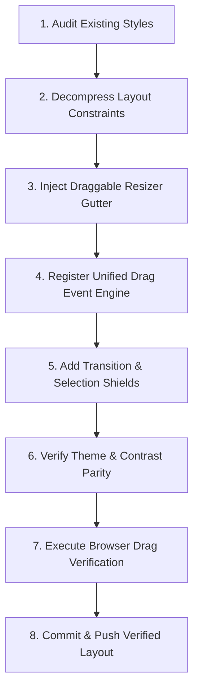

# 🎓 Skill: Visual-Preserving UI Layout Refactoring & Draggable Resizer Framework

This document defines the official, step-by-step framework for refactoring rigid layouts into flexible, draggable, and persistent multi-pane workspaces on the Chord Genius project. It guarantees that any future layout changes **preserve 100% of existing visual aesthetics** (buttons, inputs, borders, typography, HSL variables) while introducing highly fluid, responsive layouts.

---

## 🔄 The Visual-Preserving Layout Workflow



---

## 📋 Step-by-Step Implementation Framework

### 🔍 Step 1: Auditing & Preserving Styles (Safety First!)
Before editing any layout properties, future agents MUST protect existing button styles, padding, background gradients, and font families.
1. **Identify Root CSS Variables**: Locate theme-specific color tokens (`var(--primary)`, `var(--bg)`, `var(--panel-bg)`, `var(--border)`).
2. **Isolate Pane Structures**: Note the existing class wrappers for target panes (e.g. `.panel-left` for controls, `.panel-right` for previews).
3. **Capture Specificity**: Look for page-specific overrides (like `.rehearse-left` or `.rehearse-right`) that might override layout defaults.

---

### 🔓 Step 2: Decompressing Layout Constraints
To allow panels to be dragged and sized dynamically on desktop screens, rigid constraints must be refactored into a flexible sizing scheme.

1. **Remove Hardcoded Width Caps**: Locate and remove hard `max-width` constraints on resizable panels.
2. **Convert to Initial Flex-Basis**: Change default layouts from hardcoded widths (e.g., `width: 400px;`) to a flexible basis with a `flex-shrink: 0` lock:
   ```css
   .panel-left {
       width: 400px; /* Default initial layout width */
       flex-shrink: 0;
       /* Remove max-width constraints */
   }
   .panel-right {
       flex: 1; /* Let the preview panel expand organically to fill remaining space */
       min-width: 0; /* Prevent flex blowout */
   }
   ```

---

### 🔀 Step 3: Injecting the Resize Gutter
Inject a modern, transparent drag gutter element between the target left and right panels.

1. **Gutter Markup Injection**: Insert a div with class `resize-gutter` at the exact boundary of the panels:
   ```html
   <div class="resize-gutter" id="workspaceResizer"></div>
   ```
2. **Premium Hover Styling**: In `styles.css`, configure the gutter to remain visually unobtrusive until hovered, displaying a glowing golden indicator line:
   ```css
   .resize-gutter {
       width: 8px;
       margin: 0 -4px;
       cursor: col-resize;
       background: transparent;
       z-index: 100;
       position: relative;
       flex-shrink: 0;
       transition: background 0.15s ease;
       user-select: none;
       -webkit-user-select: none;
   }
   .resize-gutter::after {
       content: '';
       position: absolute;
       left: 3px; top: 0; bottom: 0;
       width: 2px;
       background: transparent;
       transition: background 0.15s ease;
   }
   .resize-gutter:hover::after,
   .resize-gutter.dragging::after {
       background: var(--primary);
       box-shadow: 0 0 8px var(--primary-glow);
   }
   @media (max-width: 1024px) {
       .resize-gutter {
           display: none !important; /* Hide on mobile/tablet stacked view */
       }
   }
   ```

---

### ⚙️ Step 4: Staging the Unified Dragging Engine
Inject a unified JavaScript module at the bottom of the files to handle dragging logic, bounds clamping, and local storage synchronization.

> [!CAUTION]
> **Falsy Coordinate Pitfall**: When calculating coordinates, NEVER use simple falsy checks like `e.clientX || ...`. On the far left of the viewport, `e.clientX` equals `0` (which is falsy), causing the script to trigger touch fallbacks, corrupt calculation metrics, and write `NaN` into `localStorage`. 
> Always explicitly check for undefined: `(e.clientX !== undefined) ? e.clientX : fallback`.

#### 📝 Reusable JavaScript Resizer Engine Template
```javascript
// ── DRAGGABLE PANEL RESIZER ──
(function() {
    const resizer = document.getElementById('workspaceResizer');
    const panelLeft = document.querySelector('.panel-left');
    const workspaceBody = document.querySelector('.workspace-body');
    if (!resizer || !panelLeft || !workspaceBody) return;

    // Load saved width from localStorage
    const savedWidth = localStorage.getItem('cg_panel_left_width');
    if (savedWidth && window.innerWidth > 1024) {
        panelLeft.style.width = savedWidth + 'px';
    }

    let startX = 0;
    let startWidth = 0;
    let isDragging = false;

    function startDrag(e) {
        if (window.innerWidth <= 1024) return; // Disable on tablet/mobilestacked layouts
        isDragging = true;
        startX = (e.clientX !== undefined) ? e.clientX : (e.touches && e.touches[0] ? e.touches[0].clientX : 0);
        startWidth = parseInt(document.defaultView.getComputedStyle(panelLeft).width, 10);
        
        resizer.classList.add('dragging');
        workspaceBody.classList.add('resizing-active');
        document.body.style.cursor = 'col-resize';
        
        document.addEventListener('mousemove', onDrag);
        document.addEventListener('mouseup', endDrag);
        document.addEventListener('touchmove', onDrag, { passive: false });
        document.addEventListener('touchend', endDrag);
    }

    function onDrag(e) {
        if (!isDragging) return;
        if (e.cancelable) e.preventDefault(); // Lock mobile touch scrolling
        
        const clientX = (e.clientX !== undefined) ? e.clientX : (e.touches && e.touches[0] ? e.touches[0].clientX : 0);
        const deltaX = clientX - startX;
        let newWidth = startWidth + deltaX;

        // Enforce strict bounds: Left panel >= 300px, Right panel >= 350px
        // Pane 1 (Workspace Sidebar) is 240px wide on desktop
        const maxLeftWidth = window.innerWidth - 350 - 240; 
        if (newWidth < 300) newWidth = 300;
        if (newWidth > maxLeftWidth) newWidth = maxLeftWidth;

        panelLeft.style.width = newWidth + 'px';
        localStorage.setItem('cg_panel_left_width', newWidth);
    }

    function endDrag() {
        if (!isDragging) return;
        isDragging = false;
        resizer.classList.remove('dragging');
        workspaceBody.classList.remove('resizing-active');
        document.body.style.cursor = '';
        
        document.removeEventListener('mousemove', onDrag);
        document.removeEventListener('mouseup', endDrag);
        document.removeEventListener('touchmove', onDrag);
        document.removeEventListener('touchend', endDrag);
    }

    resizer.addEventListener('mousedown', startDrag);
    resizer.addEventListener('touchstart', startDrag, { passive: true });
})();
```

---

### 🛡️ Step 5: Implementing Layout Shields (No-Lag Resizing)
Standard stylesheet transitions cause massive cursor lag (often 300ms) when dragging. Accidental browser highlights also corrupt inputs.

1. **Active Resizing Class**: Whenever dragging is active, append `.resizing-active` to the parent `.workspace-body`.
2. **Shield Rules**: Add these rules to `styles.css` to disable transitions instantly and suppress text selection:
   ```css
   .workspace-body.resizing-active {
       user-select: none !important;
       -webkit-user-select: none !important;
   }
   .workspace-body.resizing-active .panel-left,
   .workspace-body.resizing-active .panel-right {
       transition: none !important; /* Eliminate mouse lag and drag stutters */
   }
   ```

---

### 🎨 Step 6: Verifying Theme, Contrast, and HTML Redeclarations
1. **Background Shorthand Reset Pitfall**: NEVER use the `background` shorthand property on light mode themes for gradient text (e.g. `.brand-name`). The shorthand resets `background-clip` back to `border-box`, masking the logo with a solid gradient block. Always override using `background-image` directly:
   ```css
   /* CORRECT: Retains background-clip: text */
   [data-theme="light"] .workspace-sidebar .brand-name {
       background-image: linear-gradient(135deg, hsl(38, 90%, 42%) 0%, ...);
   }
   ```
2. **Nested Badge Text-Fill Clash**: Shield logo badges against parent text-fill gradient inheritance:
   ```css
   .badge {
       background-clip: padding-box !important;
       -webkit-background-clip: padding-box !important;
       -webkit-text-fill-color: var(--primary) !important; /* Protect contrast */
   }
   ```
3. **Avoid Inline Style Overrides**: Never inject inline styles (e.g. `style="background: ...; color: ...;"`) on nested badge elements across separate pages. Let all pages fallback to the clean, transparent, outlined badge definition in `styles.css` for absolute design consistency.
4. **Inspect Redeclarations**: Always audit console logs using `list_console_messages` to ensure copy-pasted layout scripts do not redeclare global variables (like `const urlParams = ...`), which triggers uncaught syntax exceptions.

---

### 🧪 Step 7: Executing Automated Browser Validation
Verify the layout is completely responsive and bug-free using this standard browser test suite script inside Chrome DevTools MCP `evaluate_script`:

```javascript
() => {
    var resizer = document.getElementById('workspaceResizer');
    var panelLeft = document.querySelector('.panel-left');
    if (!resizer || !panelLeft) return { error: "Layout resizer or panel not found" };

    // Reset panel default size
    panelLeft.style.width = '400px';
    var startX = resizer.getBoundingClientRect().left + 4; // Mid-point

    // Simulate drag left by 80px
    resizer.dispatchEvent(new MouseEvent('mousedown', { clientX: startX, bubbles: true }));
    document.dispatchEvent(new MouseEvent('mousemove', { clientX: startX - 80, bubbles: true }));
    var widthAfterMove = window.getComputedStyle(panelLeft).width; // Should be '320px'

    // Try dragging past boundary (clientX = 0)
    document.dispatchEvent(new MouseEvent('mousemove', { clientX: 0, bubbles: true }));
    var widthClampedMin = window.getComputedStyle(panelLeft).width; // Should be '300px'

    document.dispatchEvent(new MouseEvent('mouseup', { bubbles: true }));

    return {
        widthAfterMove: widthAfterMove,
        widthClampedMin: widthClampedMin,
        localStorageValue: localStorage.getItem('cg_panel_left_width')
    };
}
```

---
*Created by Antigravity. To run this layout framework or implement new draggable panels, open this file with IsSkillFile: true and apply the steps sequentially.*
